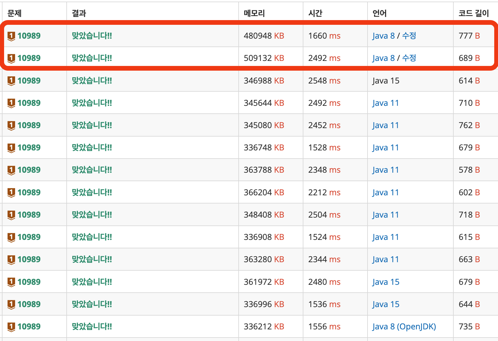
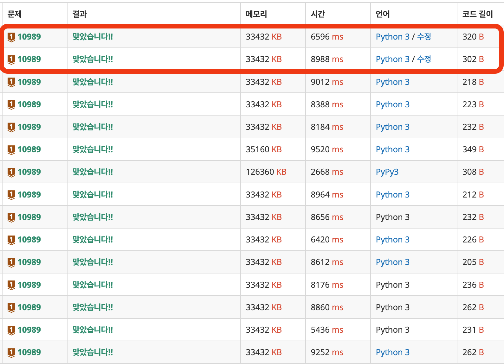

# 수 정렬하기 3

> 브론즈 1

| 시간 제한                                                   | 메모리 제한                                                | 제출   | 정답  | 맞힌 사람 | 정답 비율 |
| ----------------------------------------------------------- | ---------------------------------------------------------- | ------ | ----- | --------- | --------- |
| 5 초  ([하단 참고](https://www.acmicpc.net/problem/10989#)) | 8 MB ([하단 참고](https://www.acmicpc.net/problem/10989#)) | 359393 | 86652 | 66340     | 23.996%   |

## 문제

N개의 수가 주어졌을 때, 이를 오름차순으로 정렬하는 프로그램을 작성하시오.

## 입력

첫째 줄에 수의 개수 N(1 ≤ N ≤ 10,000,000)이 주어진다. 둘째 줄부터 N개의 줄에는 수가 주어진다. 이 수는 10,000보다 작거나 같은 자연수이다.

## 출력

첫째 줄부터 N개의 줄에 오름차순으로 정렬한 결과를 한 줄에 하나씩 출력한다.

​			 		

## 예제 입력 1 						

```
10
5
2
3
1
4
2
3
5
1
7
```

## 예제 출력 1 						

```
1
1
2
2
3
3
4
5
5
7
```

---

# Solutions

## v1

```java
import java.io.*;
import java.util.*;

public class q10989 {
    public static void main(String[] args) throws IOException {

        // 입력 및 전처리
        BufferedReader br = new BufferedReader(new InputStreamReader(System.in));
        int count = Integer.parseInt(br.readLine());

        int[] nums = new int[count];
        for (int i = 0; i < nums.length; i++) {
            nums[i] = Integer.parseInt(br.readLine());
        }

        // processing : 정렬
        Arrays.sort(nums);

        // 출력
        StringBuilder sb = new StringBuilder();
        for (int num : nums) {
            sb.append(num).append("\n");
        }

        System.out.print(sb);
    }
}
```

항상 첫 번째 시도는 '그냥' 되는지 해본다. `java`의 `Arrays.sort()` API를 이용해서 통과할 수 있는지 궁금했다. 메모리도 메모리지만 시간을 초과하지 않을지 궁금했는데, 웬걸? 통과했다. 물론 빠르지는 않았다. `2492ms`라는 비교적 느린 속도가 나왔다. 

자, 그럼 더 빠르고 효율적인 정렬 알고리즘은 뭐가 있을까? 아직까지 내 알고리즘 짬밥(?)이 부족해, `chat GPT`에게 물어봤다. 그 결과 **계수 정렬**이라는 답변을 받았다. 계수 정렬을 적용하는 이유는 **입력되는 값의 범위가 크지 않기 때문**이다. 최대 `10,000`까지 가능하므로, 우리가 다룰 배열의 크기 자체는 `10,000 + 1`로 고정된다. 즉, **배열의 index마다 해당 숫자의 count를 담는 것으로 정렬된 효과**를 볼 수 있는 것이다.

## v2 (Counting Sort)

```java
import java.io.*;
import java.util.*;

public class q10989 {

    public static void main(String[] args) throws IOException {

        // 입력 및 전처리
        BufferedReader br = new BufferedReader(new InputStreamReader(System.in));
        int count = Integer.parseInt(br.readLine());
        int offset = 10001;

        int[] nums = new int[offset];
        for (int i = 0; i < count; i++) {
            int num = Integer.parseInt(br.readLine());
            nums[num] += 1;
        }

        StringBuilder sb = new StringBuilder();
        for (int i = 1; i < offset; i++) {
            if (nums[i] > 0) {
                for (int j = 0; j < nums[i]; j++) {
                    sb.append(i).append("\n");
                }
            }
        }

        System.out.print(sb);
    }
}
```

1부터 10,000까지 각 숫자의 등장 횟수를 counting하여, 그만큼 숫자를 출력하는 방법이다. v1 버전에 비해 더 빠른 결과를 냈다.

## v3 (python)

```python
"""백준 10989 수 정렬하기 3"""

import sys

count = int(sys.stdin.readline())
offset = 10001
nums = [0] * offset

for i in range(count) :
    num = int(sys.stdin.readline())
    nums[num] += 1

for i in range(offset) :
    if nums[i] > 0 :
        for _ in range(nums[i]) :
            sys.stdout.write(f"{i}\n")

```

계수 정렬을 이용한 `python` 버전이다. 아래 결과를 보면 알겠지만, `8988ms`라는 어마어마하게 느린 속도를 보고 개선했는데 여전히 느리다. 다른 `python` 정답자들의 결과를 보니, 다행히 내가 잘못 짠 것은 아닌 것 같다. 


## 결과

| 제출 번호 | 결과         | 메모리 | 시간 | 언어                                                         | 코드 길이 | 제출한 시간                     |
| --------- | ------------ | ------ | ---- | ------------------------------------------------------------ | --------- | ------------------------------- |
| 97079502  | 맞았습니다!! | 33432  | 6596 | [Python 3](https://www.acmicpc.net/source/97079502) / [수정](https://www.acmicpc.net/submit/10989/97079502) | 320       | [4분 전](javascript:void(0);)   |
| 97079185  | 맞았습니다!! | 33432  | 8988 | [Python 3](https://www.acmicpc.net/source/97079185) / [수정](https://www.acmicpc.net/submit/10989/97079185) | 302       | [14분 전](javascript:void(0);)  |
| 97079088  | 맞았습니다!! | 480948 | 1660 | [Java 8](https://www.acmicpc.net/source/97079088) / [수정](https://www.acmicpc.net/submit/10989/97079088) | 777       | [18분 전](javascript:void(0);)  |
| 97077417  | 맞았습니다!! | 509132 | 2492 | [Java 8](https://www.acmicpc.net/source/97077417) / [수정](https://www.acmicpc.net/submit/10989/97077417) | 689       | [1시간 전](javascript:void(0);) |



