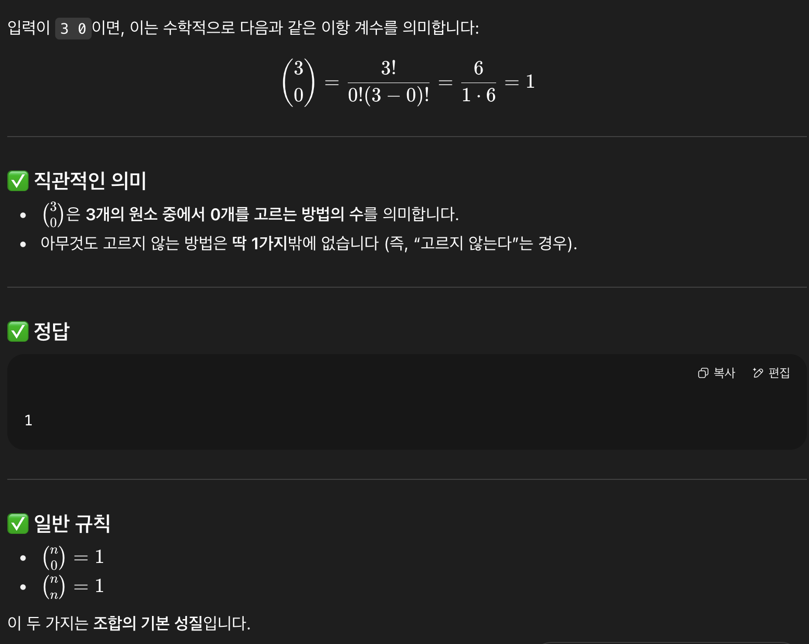
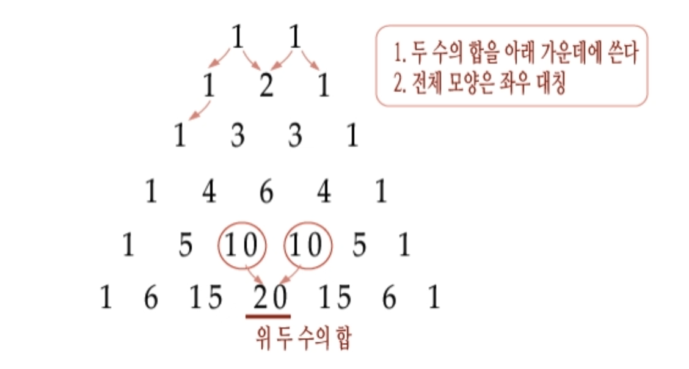
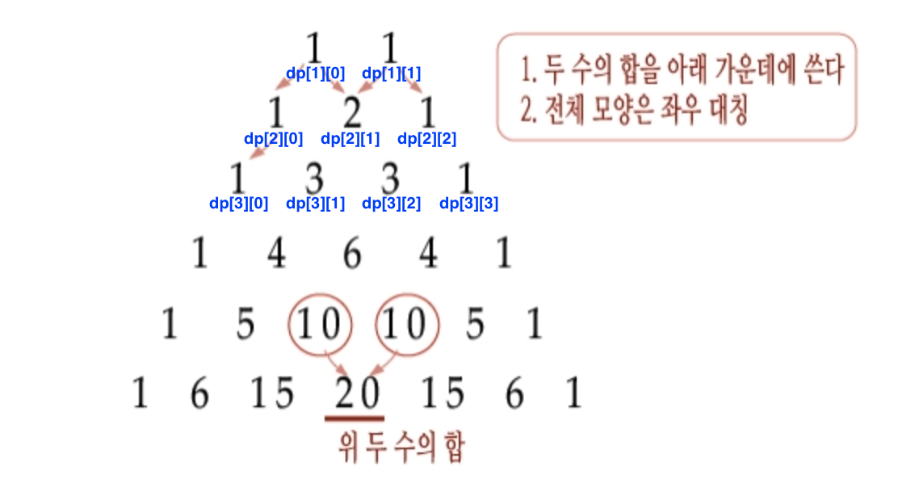

# [이항 계수 1](https://www.acmicpc.net/problem/11050)

> 브론즈 1

| 시간 제한 | 메모리 제한 | 제출  | 정답  | 맞힌 사람 | 정답 비율 |
| --------- | ----------- | ----- | ----- | --------- | --------- |
| 1 초      | 256 MB      | 86600 | 56147 | 48608     | 64.612%   |

## 문제

자연수 $N$과 정수 $K$가 주어졌을 때 이항 계수 $\binom{N}{K}$를 구하는 프로그램을 작성하시오.

## 입력

첫째 줄에 $N$과 $K$가 주어진다. $(1 ≤ N ≤ 10,\ 0 ≤ K ≤ N)$

## 출력

 $\binom{N}{K}$를 출력한다.

## 예제 입력 1 						

```
5 2
```

## 예제 출력 1 						

```
10
```

---

# Solutions

`이항 계수`가 뭘까... 진짜 학생 때 배웠던 것들은 하나도 기억을 못 한다. ~~어휴.~~ 어쩔 수 없이 오늘도 `chatGPT`와 상의(?)를 한다. 구글링으로 블로그를 뒤지던 것보다 훨씬 나은 답변이다. 쉽게 말해 **여러 개(N)의 요소 중에서 K개 만큼을 선택하는 경우의 수**를 의미한다. 문제에 있는 5와 2는 5개 중에 2개를 선택할 수 있는 경우의 수이며, 이는 10개이다.

K에 0이 들어오면 어떻게 될지 궁금해서 질문했는데, 덕분에 위 내용을 알았고 문제에 대한 이해가 쉬워졌다. 아래는 gpt의 답변이다.




## v1

```java
import java.io.*;
import java.util.StringTokenizer;

public class q11050 {
    public static void main(String[] args) throws IOException {
        BufferedReader br = new BufferedReader(new InputStreamReader(System.in));
        StringTokenizer st = new StringTokenizer(br.readLine());

        int n = Integer.parseInt(st.nextToken());
        int k = Integer.parseInt(st.nextToken());

        if (n == k || k == 0) {

            System.out.print(1);
        } else {
            
            int result = getFactorial(n) / (getFactorial(k) * getFactorial(n - k));
            System.out.print(result);
        }
    }
    
    private static int getFactorial(int num) {
        if (num <= 2) return num;

        int fac = 1;
        for (int i = 2; i <= num; i++) {
            fac *= i;
        }

        return fac;
    }
}
```

먼저 간단하게 위 공식에 맞춰 **단순 구현**으로 풀어봤다. 굳이 0으로 나누는 계산이 처리되지 않게 1이 나와야 하는 경우는 조기 종료로 처리했다. 지금 문제는 입력 값의 범위가 크지 않아서 이렇게 처리할 수 있다. 결과는 `64ms`로 충분히 빠르다.

하지만, 문제에 번호가 붙은 것을 보니 나중에는 입력 값이 커질 것 같다. 그런 경우를 미리 연습해보자.

## v2 (dp)

```java
import java.io.*;
import java.util.StringTokenizer;

public class q11050 {
    public static void main(String[] args) throws IOException {
        BufferedReader br = new BufferedReader(new InputStreamReader(System.in));
        StringTokenizer st = new StringTokenizer(br.readLine());

        int n = Integer.parseInt(st.nextToken());
        int k = Integer.parseInt(st.nextToken());

        if (n == k || k == 0) {
            System.out.print(1);
            return;
        }

        int[] dp = new int[n + 1];
        dp[0] = 1;
        dp[1] = 1;
        dp[2] = 2;
        for (int i = 3; i <= n; i++) {
            dp[i] = dp[i - 1] * i;
        }

        int result = dp[n] / (dp[k] * dp[n - k]);
        System.out.print(result);
    }
}

```

각각의 factorial 결과를 미리 저장한 뒤 사용하는 `dp` 방식이다. 이번 문제에선 범위가 작아 별로 효율적이진 않다. 결과는 `64ms`로 `v1`과 같다. 하지만, 결국 나중에 이 방법을 활용하게 되지 않을까? 입력 값의 범위가 커질수록 `v2`가 더 빠를 테니까 말이다.

## v3 (dp 2)

```java
import java.io.*;
import java.util.StringTokenizer;

public class q11050 {
    public static void main(String[] args) throws IOException {
        BufferedReader br = new BufferedReader(new InputStreamReader(System.in));
        StringTokenizer st = new StringTokenizer(br.readLine());

        int n = Integer.parseInt(st.nextToken());
        int k = Integer.parseInt(st.nextToken());

        if (n == k || k == 0) {
            System.out.print(1);
            return;
        }

        int[][] dp = new int[n + 1][k + 1];
        for (int i = 0; i <= n; i++) {

            int jMax = Math.min(i, k);  // 문제에서 k는 n보다 작거나 같다.
            for (int j = 0; j <= jMax; j++) {
                
                if (j == 0 || j == i) {
                    dp[i][j] = 1;
                } else {
                    dp[i][j] = dp[i - 1][j - 1] + dp[i - 1][j];
                }
            }
        }

        System.out.print(dp[n][k]);
    }
}
```

이번엔 `gpt`가 개선해준 소스 코드다. `dp`를 적용했지만 나와 달리 **2차원 배열**을 이용했다. 기존 나의 소스 코드 `v2`에서는 25 line에서 큰 수의 곱셉으로 인해 **오버플로우**가 발생할 수도 있다는 점을 고려하면 이 소스 코드가 분명 **더 안전**하다. 다만 `v3`의 점화식을 보면 **파스칼 삼각형**을 이해하고 있어야 풀 수 있는 문제다. 그런 점에서 이걸 기억하지 못하거나, 문제를 푸는 과정에서 찾아내지 못하면 오히려 알던 문제를 해결하지 못할 수 있다. 

대신 아래의 **그림을 그릴(이해할) 수 있다면 dp의 점화식을 구성하는 것은 어렵지 않다**.

### 파스칼 삼각형 구조



위 구조를 dp로 표현하면 다음과 같다.



[파스칼 삼각형과 이항계수에 대한 글](https://blog.naver.com/vollollov/220947452823)을 참고하자

시간이 촉박하거나, **파스칼 삼각형이 기억나지 않을 경우 좀 더 직관적인** `factorial` 형태의 `v2 (dp)`를 적용하자.

## v4 (python)

```python
"""백준 11050. 이항 계수 1"""
import sys

input = sys.stdin.readline

def solution():
    n, k = map(int, input().split())

    if n == k or k == 0 :
        sys.stdout.write(str(1))
        return
        
    dp = [1] * (n + 1)
    for i in range(2, n + 1) :
        dp[i] = dp[i - 1] * i

    result = dp[n] // (dp[k] * dp[n - k])
    sys.stdout.write(str(result))

if __name__ == "__main__" :
    solution()

```

`python`으로 풀이한 소스 코드다. `v2` 버전을 `python`으로 변경한 것이며, dp 초기화가 조금 다른 점과 정수 나눗셈을 위해 `//`를 사용한 점 등의 차이점을 참고하자.


## 결과

| 제출 번호 | 결과         | 메모리 | 시간 | 언어                                                         | 코드 길이 | 제출한 시간                    |
| --------- | ------------ | ------ | ---- | ------------------------------------------------------------ | --------- | ------------------------------ |
| 97122279  | 맞았습니다!! | 11520  | 64   | [Java 8](https://www.acmicpc.net/source/97122279) / [수정](https://www.acmicpc.net/submit/11050/97122279) | 966       | [2분 전](javascript:void(0);)  |
| 97121876  | 맞았습니다!! | 32412  | 40   | [Python 3](https://www.acmicpc.net/source/97121876) / [수정](https://www.acmicpc.net/submit/11050/97121876) | 418       | [16분 전](javascript:void(0);) |
| 97121638  | 맞았습니다!! | 11528  | 64   | [Java 8](https://www.acmicpc.net/source/97121638) / [수정](https://www.acmicpc.net/submit/11050/97121638) | 751       | [25분 전](javascript:void(0);) |
| 97121264  | 맞았습니다!! | 11500  | 80   | [Java 8](https://www.acmicpc.net/source/97121264) / [수정](https://www.acmicpc.net/submit/11050/97121264) | 751       | [36분 전](javascript:void(0);) |
| 97121056  | 맞았습니다!! | 11480  | 64   | [Java 8](https://www.acmicpc.net/source/97121056) / [수정](https://www.acmicpc.net/submit/11050/97121056) | 830       | [44분 전](javascript:void(0);) |

