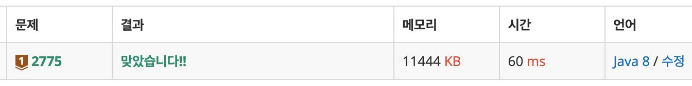

# [부녀회장이 될테야](https://www.acmicpc.net/problem/2775)

> 브론즈 1

| 시간 제한               | 메모리 제한 | 제출   | 정답  | 맞힌 사람 | 정답 비율 |
| ----------------------- | ----------- | ------ | ----- | --------- | --------- |
| 0.5 초 (추가 시간 없음) | 128 MB      | 119752 | 68623 | 58036     | 58.037%   |

## 문제

평소 반상회에 참석하는 것을 좋아하는 주희는 이번 기회에 부녀회장이 되고 싶어 각 층의 사람들을 불러 모아 반상회를 주최하려고 한다.

이 아파트에 거주를 하려면 조건이 있는데, “a층의 b호에 살려면 자신의 아래(a-1)층의 1호부터 b호까지 사람들의 수의 합만큼 사람들을 데려와 살아야 한다” 는 계약 조항을 꼭 지키고 들어와야 한다.

아파트에 비어있는 집은 없고 모든 거주민들이 이 계약 조건을 지키고 왔다고 가정했을 때, 주어지는 양의 정수 k와 n에 대해 k층에 n호에는 몇 명이 살고 있는지 출력하라. 단, 아파트에는 0층부터 있고 각층에는 1호부터 있으며, 0층의 i호에는 i명이 산다.

## 입력

첫 번째 줄에 Test case의 수 T가 주어진다. 그리고 각각의 케이스마다 입력으로 첫 번째 줄에 정수 k, 두 번째 줄에 정수 n이 주어진다

## 출력

각각의 Test case에 대해서 해당 집에 거주민 수를 출력하라.

## 제한

- 1 ≤ k, n ≤ 14

## 예제 입력 1 						

```
2
1
3
2
3
```

## 예제 출력 1 						

```
6
10
```

---

# Solutions

## v1

```java
import java.io.*;

public class q2775 {
    public static void main(String[] args) throws IOException {

        // dp -> 0~14층, 1~14호
        int[][] dp = new int[15][15];
        for (int i = 1; i <= 14; i++) {
            dp[0][i] = i;
        }
        for (int i = 1; i <= 14; i++) {     // i = 층
            for (int j = 1; j <= 14; j++) { // j = 호
                if (j == 1) {
                    dp[i][j] = 1;
                } else {
                    dp[i][j] = dp[i - 1][j] + dp[i][j - 1];
                }
            }
        }

        // 입력 
        BufferedReader br = new BufferedReader(new InputStreamReader(System.in));
        int count = Integer.parseInt(br.readLine());

        StringBuilder sb = new StringBuilder();
        for (int i = 0; i < count; i++) {
            int floor = Integer.parseInt(br.readLine());
            int room = Integer.parseInt(br.readLine());
            sb.append(dp[floor][room]).append("\n");
        }

        System.out.print(sb);
    }
}

/*
 * {0, 1} = 1
 * {0, 2} = 2
 * {0, 3} = 3
 * {0, 4} = 4
 * ...
 * 
 * (1, 1) = 1
 * {1, 2} = 3
 * (1, 3) = 6
 * {1, 4} = 10
 * ...
 * 
 * {2, 1} = 1
 * {2, 2} = 4
 * {2, 3} = 10
 * {2, 4} = 20
 * 
 */
```

브론즈 레벨이라 그런지... `DP`로 풀어야 한다는 생각이 바로 들었다. `점화식`을 어떻게 만들까 잠시 고민했는데, 아래 주석으로 작성해 보니 다행히 규칙이 보였다. 결과는 `60ms`로, 크게 개선할 것은 없을 것 같다.

