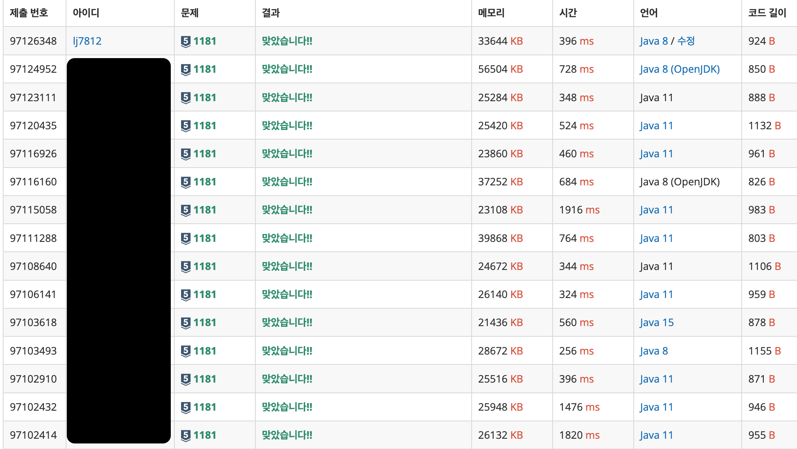

# [단어 정렬](https://www.acmicpc.net/problem/1181)

> 실버 5

| 시간 제한 | 메모리 제한 | 제출   | 정답   | 맞힌 사람 | 정답 비율 |
| --------- | ----------- | ------ | ------ | --------- | --------- |
| 2 초      | 256 MB      | 234194 | 100236 | 74994     | 41.011%   |

## 문제

알파벳 소문자로 이루어진 N개의 단어가 들어오면 아래와 같은 조건에 따라 정렬하는 프로그램을 작성하시오.

1. 길이가 짧은 것부터
2. 길이가 같으면 사전 순으로

단, 중복된 단어는 하나만 남기고 제거해야 한다.

## 입력

첫째 줄에 단어의 개수 N이 주어진다. (1 ≤ N ≤ 20,000) 둘째 줄부터 N개의 줄에 걸쳐 알파벳 소문자로 이루어진 단어가 한 줄에 하나씩 주어진다. 주어지는 문자열의 길이는 50을 넘지 않는다.

## 출력

조건에 따라 정렬하여 단어들을 출력한다.

​			 		

## 예제 입력 1 						

```
13
but
i
wont
hesitate
no
more
no
more
it
cannot
wait
im
yours
```

## 예제 출력 1 						

```
i
im
it
no
but
more
wait
wont
yours
cannot
hesitate
```

---

# Solutions

## v1

```java
import java.io.*;
import java.util.*;

public class q1181 {
    public static void main(String[] args) throws IOException {

        // 입력 및 전처리
        BufferedReader br = new BufferedReader(new InputStreamReader(System.in));
        int count = Integer.parseInt(br.readLine());

        Set<String> wordSet = new HashSet<String>();
        for (int i = 0; i < count; i++) {
            wordSet.add(br.readLine());
        }

        // 정렬 (길이, 알파벳)
        List<String> wordList = new ArrayList<>(wordSet);
        wordList.sort((a, b) -> {
            if (a.length() == b.length()) {
                return a.compareTo(b);
            } else {
                return a.length() - b.length();
            }
        });

        // 출력
        StringBuilder sb = new StringBuilder();
        for (String word : wordList) {
            sb.append(word).append("\n");
        }

        System.out.print(sb);
    }
}
```

첫 번째 시도는 언제나 **단순 구현**이다. (~~국룰~~) 중복을 제거하기 위한 `HashSet`과 정렬을 위한 `sort()`를 구현했다. 너무 정직하게 해서 성능이 좋지 않을 줄 알았는데 다른 사람들의 결과에 비해 느리진 않다. 시간은 `396ms`가 걸렸다.



다른 사람의 제출 중, `256ms`가 걸린 굉장히 빠른 솔루션을 확인해봤는데 `Set` 대신 `배열`을 사용했고, 정렬 이후 출력 과정에서 이전과 같지 않은 경우만 출력하는 방식이었다. 

반면, `2000ms` 이상 걸린 무지막지한 경우도 열어봤는데, 입력부터 `Scanner`를 사용한 것은 물론이고, `List`에 담을 때마다 `contains()`를 체크했다. `Collections.sort()`를 구현한 것까진 좋았으나, 출력 과정에서 `stream()`과 더불어 `System.out.println()`을 그대로 사용했다. 

실무에서 Spring Backend Application이 파일 입출력을 처리하는 일은 흔치 않을 거라고 생각하기 때문에 입출력 처리 기능에 대해선 하기 나름이라고 생각한다. 다만 `List`를 사용하면서 건건이 중복 처리를 한 점, 그리고 또 건건이 출력을 했다는 점에서는 분명 아쉬운 로직이다. 

## v2 (작은 개선)

```java
import java.io.*;
import java.util.*;

public class q1181 {
    public static void main(String[] args) throws IOException {

        // 입력 및 전처리
        BufferedReader br = new BufferedReader(new InputStreamReader(System.in));
        int count = Integer.parseInt(br.readLine());

        Set<String> wordSet = new HashSet<String>(count);
        for (int i = 0; i < count; i++) {
            wordSet.add(br.readLine());
        }

        // 정렬 (길이, 알파벳)
        List<String> wordList = new ArrayList<>(wordSet);
        wordList.sort(Comparator.comparingInt(String::length).thenComparing(Comparator.naturalOrder()));

        // 출력
        StringBuilder sb = new StringBuilder();
        for (String word : wordList) {
            sb.append(word).append('\n');
        }

        System.out.print(sb);
    }
}
```

결과는 `400ms`로 비슷하다. 다만 `sort`의 가독성이 좋아졌다. 그 외에도 `Set` 카운트 초기화와 `StringBuilder.append()`에서 double quote를 single quote로 바꿨다. 모두 `chatGPT`의 제안인데, 사실 속도 측면에서는 개선할 부분이 없다고 답변 받았다. 

개인적으로는 `sort` 부분도 이전 버전이 더 직관적이라 좋다. 무조건 축약하는 게 좋다고 생각하진 않는다. 

## v3 (python)

```python
"""백준 1181. 단어 정렬"""

import sys

input = sys.stdin.readline

def solution() :
    count = int(input())

    words = set()
    for _ in range(count) :
        words.add(input().strip())
    
    words_sorted = sorted(words, key= lambda x: (len(x), x))
    sys.stdout.write("\n".join(words_sorted) + "\n")

if __name__ == "__main__" :
    solution()

```

`python`에서도 `set` 자료구조를 사용할 수 있으며, `sort`를 구현하는 것도 굉장히 간단하다. 다만 이건 기존 내 코드의 변형 버전이므로, 아래 코드가 좀 더 `pythonic`한 코드라고 볼 수 있겠다.

## v4 (pythonic)

```python
"""백준 1181. 단어 정렬"""

import sys

input = sys.stdin.readline

def solution() :
    count = int(input())

    words = {input().strip() for _ in range(count)} # set comprehension : 중복을 제거함
    words_sorted = sorted(words, key= lambda x: (len(x), x))
    sys.stdout.write("\n".join(words_sorted) + "\n")

if __name__ == "__main__" :
    solution()

```


## 결과

| 제출 번호 | 결과         | 메모리 | 시간 | 언어                                                         | 코드 길이 |
| --------- | ------------ | ------ | ---- | ------------------------------------------------------------ | --------- |
| 97128803  | 맞았습니다!! | 39508  | 68   | [Python 3](https://www.acmicpc.net/source/97128803) / [수정](https://www.acmicpc.net/submit/1181/97128803) | 369       |
| 97128548  | 맞았습니다!! | 39508  | 80   | [Python 3](https://www.acmicpc.net/source/97128548) / [수정](https://www.acmicpc.net/submit/1181/97128548) | 361       |
| 97127214  | 맞았습니다!! | 32620  | 400  | [Java 8](https://www.acmicpc.net/source/97127214) / [수정](https://www.acmicpc.net/submit/1181/97127214) | 841       |
| 97126348  | 맞았습니다!! | 33644  | 396  | [Java 8](https://www.acmicpc.net/source/97126348) / [수정](https://www.acmicpc.net/submit/1181/97126348) | 924       |