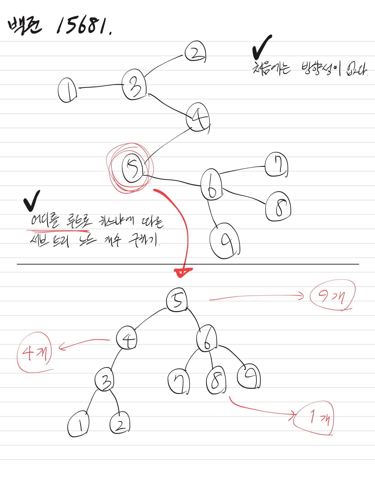

# [트리와 쿼리](https://www.acmicpc.net/problem/15681)

> 골드 5

| 시간 제한 | 메모리 제한 | 제출  | 정답  | 맞힌 사람 | 정답 비율 |
| --------- | ----------- | ----- | ----- | --------- | --------- |
| 1 초      | 128 MB      | 21995 | 10490 | 7952      | 45.218%   |

## 문제

간선에 가중치와 방향성이 없는 임의의 루트 있는 트리가 주어졌을 때, 아래의 쿼리에 답해보도록 하자.

- 정점 U를 루트로 하는 서브트리에 속한 정점의 수를 출력한다.

만약 이 문제를 해결하는 데에 어려움이 있다면, 하단의 힌트에 첨부한 문서를 참고하자.

## 입력

트리의 정점의 수 N과 루트의 번호 R, 쿼리의 수 Q가 주어진다. (2 ≤ N ≤ 105, 1 ≤ R ≤ N, 1 ≤ Q ≤ 105)

이어 N-1줄에 걸쳐, U V의 형태로 트리에 속한 간선의 정보가 주어진다. (1 ≤ U, V ≤ N, U ≠ V)

이는 U와 V를 양 끝점으로 하는 간선이 트리에 속함을 의미한다.

이어 Q줄에 걸쳐, 문제에 설명한 U가 하나씩 주어진다. (1 ≤ U ≤ N)

입력으로 주어지는 트리는 항상 올바른 트리임이 보장된다.

## 출력

Q줄에 걸쳐 각 쿼리의 답을 정수 하나로 출력한다.

​			 		

## 예제 입력 1 						

```
9 5 3
1 3
4 3
5 4
5 6
6 7
2 3
9 6
6 8
5
4
8
```

## 예제 출력 1 						

```
9
4
1
```

## 힌트

(내용 생략)


---

# Solutions

처음에 문제를 잘 이해하지 못했다가, 역시 트리를 그려보고 나서야 이해했다. 물론 힌트에도 트리에 대한 그림이 표현되어 있다. 다음은 내가 직접 그리고 메모한 내용이다.



일반적으로 트리 문제라면 `bfs` 또는 `dfs` 알고리즘으로 풀게 된다. 이 문제는 특정 노드를 루트라고 가정했을 때, 각각의 서브 트리 노드 개수를 구하는 것이다. 따라서, **깊이 탐색**을 우선으로 하는 `dfs` 알고리즘이 적합할 것으로 예상된다.


## v1 (dfs)

```java
import java.io.*;
import java.util.*;

public class q15681 {
    public static void main(String[] args) throws IOException {

        // (1) 입력값 -> 확인
        BufferedReader br = new BufferedReader(new InputStreamReader(System.in));
        StringTokenizer st = new StringTokenizer(br.readLine());

        int nodeCount = Integer.parseInt(st.nextToken());
        int nodeRoot = Integer.parseInt(st.nextToken());
        int queryCount = Integer.parseInt(st.nextToken());

        // (2) 입력값 -> 트리(간선 정보)
        ArrayList<Integer>[] tree = new ArrayList[nodeCount + 1];
        for (int i = 1; i <= nodeCount; i++) {
            tree[i] = new ArrayList<Integer>();
        }

        for (int i = 1; i < nodeCount; i++) {
            st = new StringTokenizer(br.readLine());
            int node1 = Integer.parseInt(st.nextToken());
            int node2 = Integer.parseInt(st.nextToken());

            tree[node1].add(node2);
            tree[node2].add(node1);
        }

        // (3) 입력값 -> 쿼리
        StringBuilder sb = new StringBuilder();
        for (int i = 0; i < queryCount; i++) {
            
            int query = Integer.parseInt(br.readLine());
            if (query == nodeRoot) {
                sb.append(nodeCount).append("\n");
                continue;
            }

            // (4) dfs
            boolean[] visited = new boolean[nodeCount + 1];
            int count = dfsFind(tree, nodeRoot, query, visited);
            sb.append(count).append("\n");
        }

        // (4) 출력
        System.out.print(sb);
    }

    private static int dfsFind(ArrayList<Integer>[] tree, int startNode, int queryNode, boolean[] visited) {

        visited[startNode] = true;
        if (startNode == queryNode) {
            return dfsCount(tree, startNode, visited);
        }
        
        for (int currentNode : tree[startNode]) {
            if (visited[currentNode] == false) {    

                visited[currentNode] = true;
                int result = dfsFind(tree, currentNode, queryNode, visited);
                if (result != -1) {

                    return result;
                }
            }
        }

        return -1;
    }

    private static int dfsCount(ArrayList<Integer>[] tree, int startNode, boolean[] visited) {
        // visited[startNode] = true;   // 중복

        int count = 1;
        for (int currentNode : tree[startNode]) {
            if (visited[currentNode] == false) {

                visited[currentNode] = true;
                count += dfsCount(tree, currentNode, visited);
            }
        }

        return count;
    }
}

```

처음에 `dfs` 함수 하나만 만들어서 풀려다가 내가 짠 코드에 내가 빠져버렸다. `root`로 삼을 `node`를 만나면 카운팅을 시작하려고 로직을 녹여봤는데 점점 꼬여만 갔다. `dfs` 함수를 분리하니 훨씬 나아졌다. 다만 이 코드는 (아마도) 답은 맞추겠지만 테스트에 통과하지는 못한다. **시간 초과**로 실패하기 때문이다. 그렇다는 것은... `dp` 알고리즘을 적용할 필요가 있다는 의미일 것이다. **이미 카운트가 끝난 경로를 매번 query 마다 다시 세고 있으니** 그럴만 하다.

## v2 (dp + dfs)

```java
import java.io.*;
import java.util.*;

public class q15681_dp {
    public static void main(String[] args) throws IOException {

        // (1) 입력값 -> 확인
        BufferedReader br = new BufferedReader(new InputStreamReader(System.in));
        StringTokenizer st = new StringTokenizer(br.readLine());

        int nodeCount = Integer.parseInt(st.nextToken());
        int nodeRoot = Integer.parseInt(st.nextToken());
        int queryCount = Integer.parseInt(st.nextToken());

        // (2) 입력값 -> 트리(간선 정보)
        ArrayList<Integer>[] tree = new ArrayList[nodeCount + 1];
        for (int i = 1; i <= nodeCount; i++) {
            tree[i] = new ArrayList<Integer>();
        }

        for (int i = 1; i < nodeCount; i++) {
            st = new StringTokenizer(br.readLine());
            int node1 = Integer.parseInt(st.nextToken());
            int node2 = Integer.parseInt(st.nextToken());

            tree[node1].add(node2);
            tree[node2].add(node1);
        }

        // v2 -> dp 적용
        int[] dp = new int[nodeCount + 1];
        boolean[] visited = new boolean[nodeCount + 1];
        dp[nodeRoot] = dfsForDP(tree, dp, nodeRoot, visited);

        // (3) 입력값 -> 쿼리
        StringBuilder sb = new StringBuilder();
        for (int i = 0; i < queryCount; i++) {
            
            int query = Integer.parseInt(br.readLine());
            sb.append(dp[query]).append("\n");
        }

        // (4) 출력
        System.out.print(sb);
    }

    private static int dfsForDP(ArrayList<Integer>[] tree, int[] dp, int currentNode, boolean[] visited) {
        visited[currentNode] = true;

        int count = 1;
        for (int nextNode : tree[currentNode]) {

            if (visited[nextNode] == false) {
                visited[nextNode] = true;

                count += dfsForDP(tree, dp, nextNode, visited);
            }
        }

        dp[currentNode] = count;
        return count;
    }
}

```

코드가 훨씬 짧아졌고(87 lines -> 64 lines), **제한 시간 내에 완수**하게 되었다. 최종 시간은 `680ms`로 통과했다. 이 정도면 준수한 성적이며, 물론 나보다 빠르게 푼 경우도 많지만 어쨌든 중요한 것은 `dp`와 `dfs`를 적절히 활용해야 하는 것을 이해했다는 점이다.

/03. Gold/assets/image-20250729160646835.png)

## v3 (python)

```python
"""백준 15681. 트리와 쿼리"""

import sys
input = sys.stdin.readline
sys.setrecursionlimit(10**6)

def dfs_for_dp(tree, dp, currentNode, visited) :
    """dfs for creating dp"""
    visited[currentNode] = True

    count = 1
    for nextNode in tree[currentNode] :
        
        if visited[nextNode] == False :
            visited[nextNode] = True
            count += dfs_for_dp(tree, dp, nextNode, visited)

    dp[currentNode] = count
    return count

def main() :
    """main()"""
    node_count, node_root, query_count = map(int, (input().split()))

    tree = [[] for _ in range(node_count + 1)]    # 아래와 같은 코드
    # tree = []
    # for _ in range(node_count + 1) :
    #     tree.append([])

    for _ in range(node_count - 1) :
        node1, node2 = map(int, input().split())
        tree[node1].append(node2)
        tree[node2].append(node1)

    dp = [0] * (node_count + 1)
    visited = [False] * (node_count + 1)
    dfs_for_dp(tree, dp, node_root, visited)

    result = []
    for _ in range(query_count) :

        query_node = int(input())
        result.append(str(dp[query_node]))

    sys.stdout.write("\n".join(result))

if __name__ == "__main__" :
    main()

```

`python` 코드로 짜다가 알았는데, `dfs for dp` 함수에서 `dp[currentNode]`에 값을 세팅하고 있기 때문에 33번 line에서 꼭 반환할 필요는 없었다. 그리고 `python`이면 입출력 처리가 빠를 거라는 무심한(?) 생각으로 그냥 `input()`과 `print()`를 남발했더니 시간 초과로 실패했다. `sys.stdin.readline()`과 `sys.stdout.write()`를 적절히 활용했고, `dfs` 알고리즘의 재귀 깊이에 맞게 `sys.setrecursionlimit(10**6)` 코드를 추가했다. `python`의 기본 재귀 깊이(스택)는 **1000**으로 굉장히 작다(?).


| 제출 번호 | 결과         | 메모리 | 시간 | 언어                                                         | 코드 길이 |
| --------- | ------------ | ------ | ---- | ------------------------------------------------------------ | --------- |
| 96876959  | 맞았습니다!! | 73416  | 320  | [Python 3](https://www.acmicpc.net/source/96876959) / [수정](https://www.acmicpc.net/submit/15681/96876959) | 1096      |
| 96876683  | 시간 초과    |        |      | [Python 3](https://www.acmicpc.net/source/96876683) / [수정](https://www.acmicpc.net/submit/15681/96876683) | 1069      |
| 96875330  | 맞았습니다!! | 82384  | 680  | [Java 8](https://www.acmicpc.net/source/96875330) / [수정](https://www.acmicpc.net/submit/15681/96875330) | 1968      |
| 96874128  | 시간 초과    |        |      | [Java 8](https://www.acmicpc.net/source/96874128) / [수정](https://www.acmicpc.net/submit/15681/96874128) | 2649      |