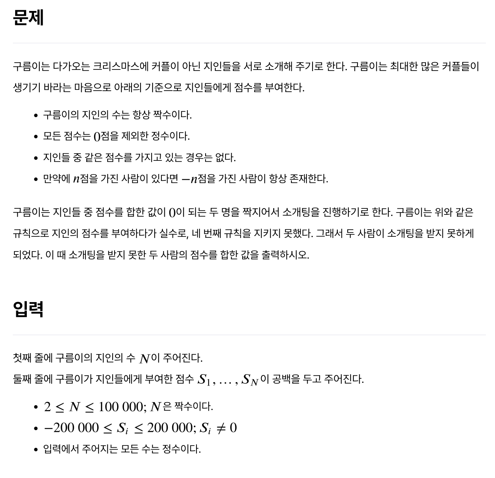
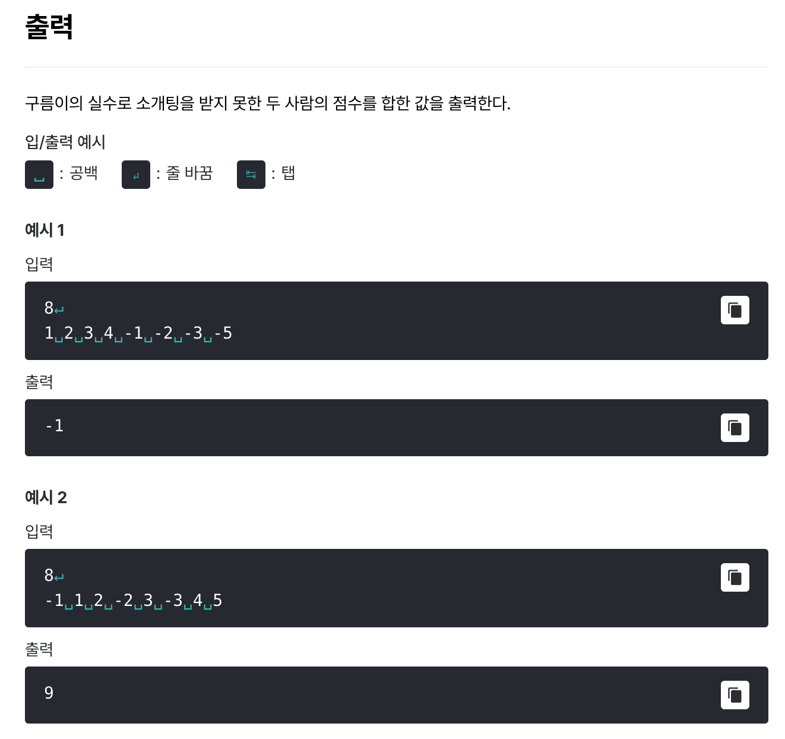

# [0커플](https://level.goorm.io/exam/159545/0%EC%BB%A4%ED%94%8C/quiz/1)

>  쉬움





---

## Solution

### v1 (오답)

```java
import java.io.*;
import java.util.*;

class Main {
	public static void main(String[] args) throws Exception {

		// 입력값 처리
		BufferedReader br = new BufferedReader(new InputStreamReader(System.in));
		int people = Integer.parseInt(br.readLine());

		StringTokenizer st = new StringTokenizer(br.readLine());
		int[] scores = new int[people];
		for (int i = 0; i < people; i++) {
			scores[i] = Integer.parseInt(st.nextToken());
		}

		// 정렬
		Arrays.sort(scores);

		// two pointer 
		int left = 0, right = people - 1;
		int result = 0; // 남은 사람의 점수
		int count = 0; // 남은 사람 수
		while (left < right) {

			// matched!
			if (scores[left] + scores[right] == 0) {
				left++;
				right--;
				continue;
			}

			// not matched...
			if (scores[left] + scores[right] < 0) {
				result += scores[left];
				count++;
				left++;
			} else {
				result += scores[right];
				count++;
				right--;
			}

			if (count == 2) break;
		}

		System.out.print(result);
	}
}

// -5 -3 -2 -1 . 1 2 3 4
// -3 -2 -1 . 1 2 3 4 5

```

처음에는 정렬한 뒤 양쪽에서 (two pointers) 찾으면 어떨까 생각했는데, 어쩌면 너무 무식한 방법이었다. 너무 순차적인 접근이랄까... 이 풀이는 15개 케이스 중 2개 케이스에서 실패한다. 이 코드를 개선할 수도 있겠지만 아래 방법이 더 낫다.

### v2 (Set 활용)

```java
import java.io.*;
import java.util.*;

class Main {
	public static void main(String[] args) throws Exception {
		
		// 입력값 전처리
		BufferedReader br = new BufferedReader(new InputStreamReader(System.in));
		int count = Integer.parseInt(br.readLine());

		StringTokenizer st = new StringTokenizer(br.readLine());
		int[] scoresArr = new int[count];
		Set<Integer> scoresSet = new HashSet<>();
		for (int i = 0; i < count; i++) {
			int score = Integer.parseInt(st.nextToken());
			scoresArr[i] = score;
			scoresSet.add(score);
		}

		// 매칭 안 된 값 찾기
		int sum = 0, unmatched = 0;
		for (int score : scoresArr) {
			if (scoresSet.contains(score * -1) == false) {
				sum += score;
				unmatched++;

				if (unmatched == 2) break;
			}
		}

		// 출력
		System.out.println(sum);
	}
}
```

단순히 생각하면 중복(절대값)이 아닌 값을 찾으면 되는 것이다. 그 내용을 기반으로 이처럼 `Set`을 활용한 풀이가 적합하다.
