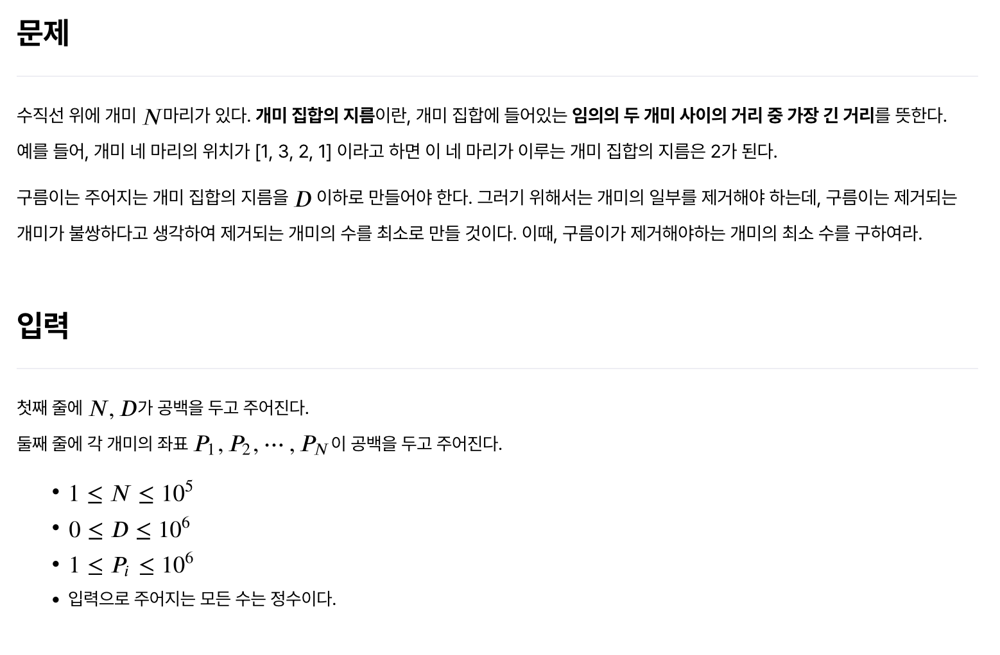
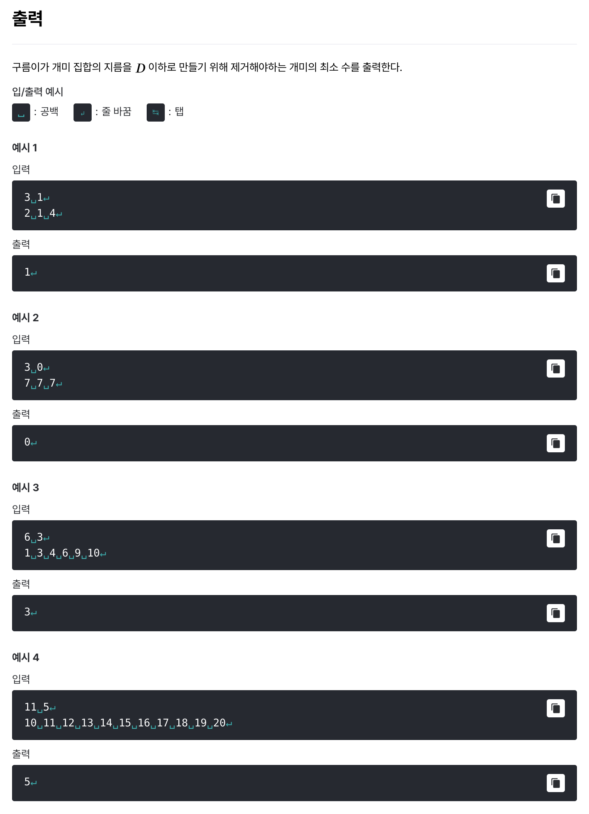

# [개미 집합의 지름](https://level.goorm.io/exam/49060/%EA%B0%9C%EB%AF%B8-%EC%A7%91%ED%95%A9%EC%9D%98-%EC%A7%80%EB%A6%84/quiz/1)

> 쉬움





---

## Solution

### v1 (two pointers)

```java
import java.io.*;
import java.util.*;

class Main {
	public static void main(String[] args) throws Exception {

		// 입력값 전처리
		BufferedReader br = new BufferedReader(new InputStreamReader(System.in));
		StringTokenizer st = new StringTokenizer(br.readLine());
		int ants = Integer.parseInt(st.nextToken());
		int distance = Integer.parseInt(st.nextToken());

		st = new StringTokenizer(br.readLine());
		int[] positions = new int[ants];
		for (int i = 0; i < ants; i++) {
			positions[i] = Integer.parseInt(st.nextToken());
		}

		// 정렬
		Arrays.sort(positions);

		// 투 포인터
		int left = 0;
		int maxAnts = 0;
		for (int right = 0; right < ants; right++) {

			// distance를 초과하지 않도록 포인터 조절
			while (positions[right] - positions[left] > distance) {
				left++;
			}

			// left ~ right 구간의 개미 수
			int antCount = right - left + 1;
			maxAnts = Math.max(maxAnts, antCount);
		}

		System.out.println(ants - maxAnts);
	}
}

// 1 2   4
// 1   3 4   6         9   10
```

