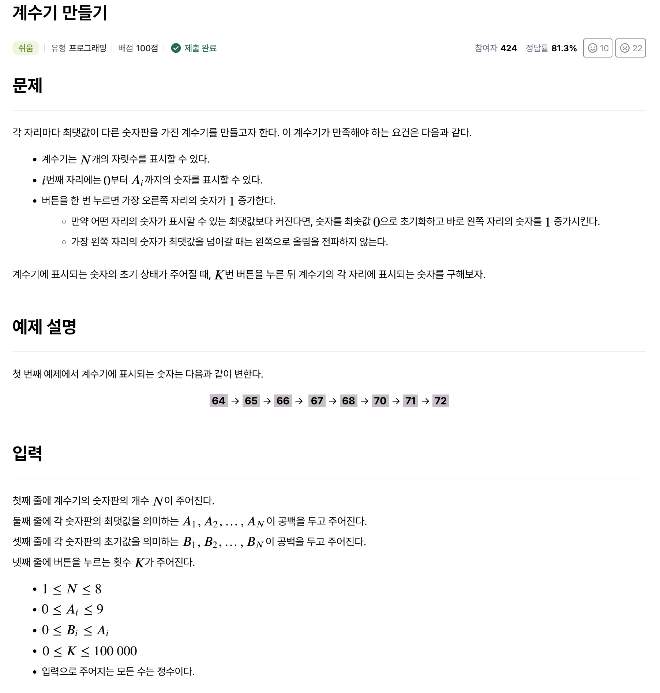
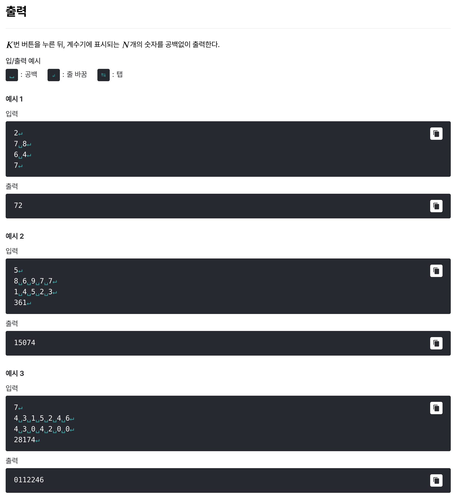

# [계수기 만들기](https://level.goorm.io/exam/43061/%EA%B3%84%EC%88%98%EA%B8%B0-%EB%A7%8C%EB%93%A4%EA%B8%B0/quiz/1)

> 쉬움





---

## Solution

### v1

```java
import java.io.*;
import java.util.*;

class Main {
	public static void main(String[] args) throws Exception {

		// 입력값 처리 : 계수기 숫자판
		BufferedReader br = new BufferedReader(new InputStreamReader(System.in));
		int n = Integer.parseInt(br.readLine());

		// 입력값 처리 : 최대 숫자
		StringTokenizer st = new StringTokenizer(br.readLine());
		int[] maxNums = new int[n];
		for (int i = 0; i < n; i++) {
			maxNums[i] = Integer.parseInt(st.nextToken());
		}

		// 입력값 처리 : 초기 숫자
		st = new StringTokenizer(br.readLine());
		int[] initNums = new int[n];
		for (int i = 0; i < n; i++) {
			initNums[i] = Integer.parseInt(st.nextToken());
		}

		// 입력값 처리 : 버튼 클릭 횟수
		int clicks = Integer.parseInt(br.readLine());
		int[] resultNums = initNums.clone();

		// 버튼 누름에 대해서 오른쪽부터 계산
		for (int i = n - 1; i >= 0 && clicks > 0; i--) {
			int sumValue = resultNums[i] + clicks;
			resultNums[i] = sumValue % (maxNums[i] + 1);
			clicks = sumValue / (maxNums[i] + 1);
		}

		// 결과 출력
		for (int i = 0; i < n; i++) {
				System.out.print(resultNums[i]);
		}
	}
}
```

