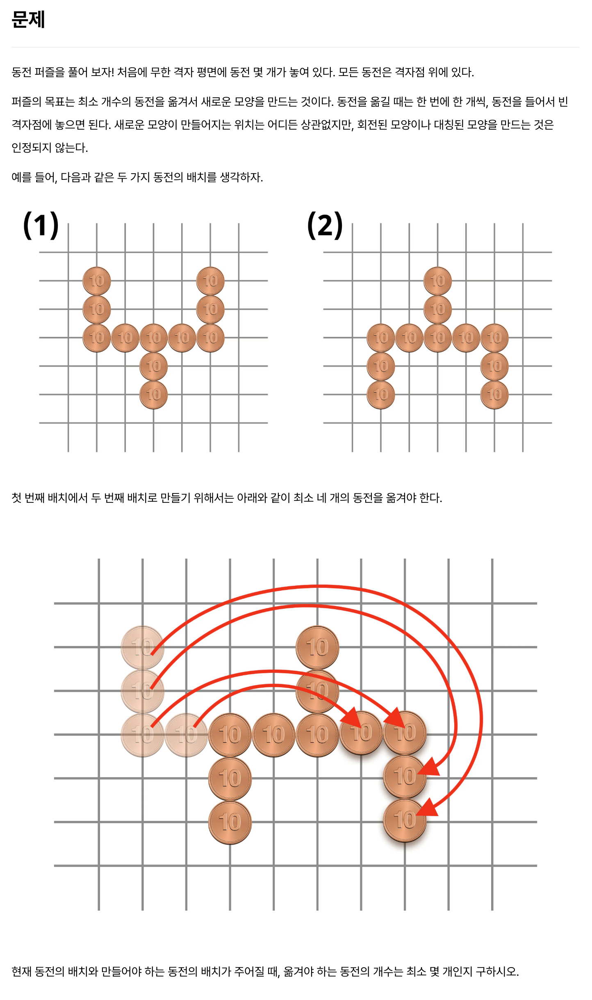
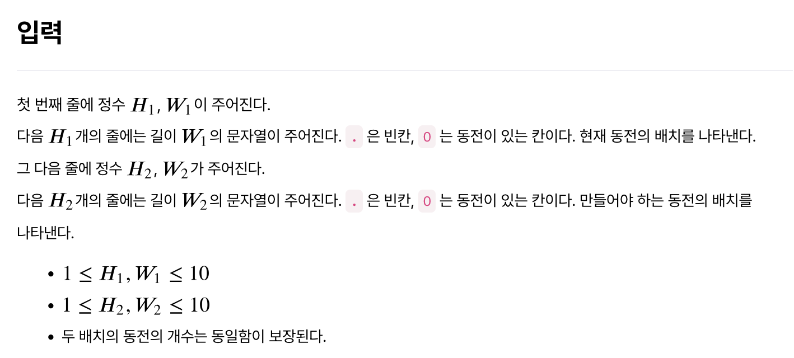
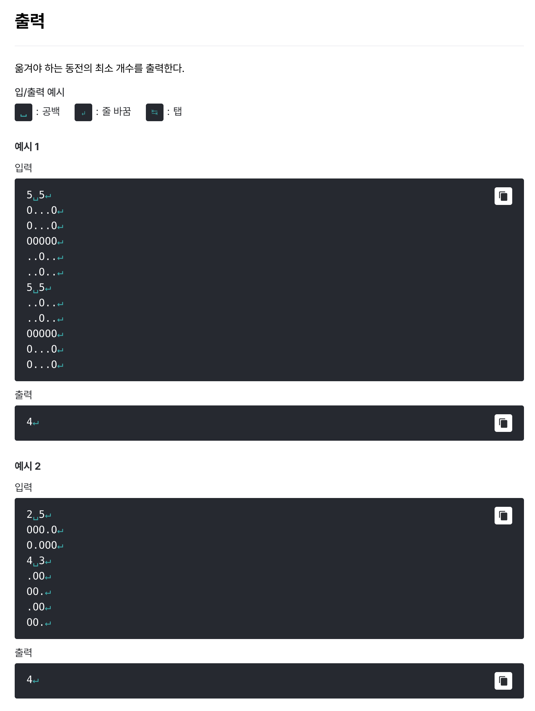

# [동전 퍼즐](https://level.goorm.io/exam/195037/%EB%8F%99%EC%A0%84-%ED%8D%BC%EC%A6%90/quiz/1)

> 쉬움







---

## Solution

### v1 (brute force) 

```java
import java.io.*;
import java.util.*;

class Main {

	private static final char COIN = 'O';
	
	public static void main(String[] args) throws Exception {
		BufferedReader br = new BufferedReader(new InputStreamReader(System.in));

		// 입력값 처리 : 첫 번째 배치
		StringTokenizer st = new StringTokenizer(br.readLine());
		int h_1 = Integer.parseInt(st.nextToken()); 
		int w_1 = Integer.parseInt(st.nextToken()); 
		
		List<int[]> first = new ArrayList<>();
		
		for (int i = 0; i < h_1; i++) {
			char[] items = br.readLine().toCharArray();
			for (int j = 0; j < w_1; j++) {
				if (COIN == items[j]) first.add(new int[] {i, j});
			}
		}

		// 입력값 처리 : 두 번째 배치
		st = new StringTokenizer(br.readLine());
		int h_2 = Integer.parseInt(st.nextToken()); 
		int w_2 = Integer.parseInt(st.nextToken()); 
		
		List<int[]> second = new ArrayList<>();
		Set<String> secondSet = new HashSet<>();
		
		for (int i = 0; i < h_2; i++) {
			char[] items = br.readLine().toCharArray();
			for (int j = 0; j < w_2; j++) {
				if (COIN == items[j]) {
					second.add(new int[] {i, j});
					secondSet.add(i + "," + j);
				}
			}
		}

		// processing : 가장 많이 겹치는 동전 수 획득
		int maxOverlapCoins = getMaxOverlapCoinCount(first, second, secondSet);
		
		// 출력
		System.out.println(first.size() - maxOverlapCoins);
	}

	private static Integer getMaxOverlapCoinCount(List<int[]> first, List<int[]> second, Set<String> secondSet) {

		int maxCount = 0;

		for (int[] coin1 : first) {
			for (int[] coin2 : second) {
				// 좌표가 들어있으므로 -> 기준점의 이동이 필요 -> 변위
				int x = coin2[0] - coin1[0];
				int y = coin2[1] - coin1[1];

				// 변위에 따른 겹침 확인 -> secondSet
				int overlaps = 0;
				for (int[] compareCoin : first) {
					String compareKey = (compareCoin[0] + x) + "," + (compareCoin[1] + y);
					if (secondSet.contains(compareKey)) {
						overlaps++;
					}
				}

				maxCount = Math.max(maxCount, overlaps);
			}
		}
		
		return maxCount;
	}

}
```

기본적인 풀이는 **"2가지의 배치를 최대한 많이 겹치게 두고, 이때 겹치지 않는 숫자의 동전이 이동에 필요한 동전"**이라는 점이 핵심이다.

`완전 탐색` + `Set`을 이용한 비교로 풀어낸 코드이다. 처음에 변위까지는 고려했는데, **비교 로직**을 짜는 게 헷갈리기 시작했다. 이후 `HashSet`을 사용한 검증을 알아내고 해결할 수 있었다. 좌표를 `"3,2"` 이런 형태로 넣고 비교하고 있다. 훨씬 수월하다.

계속 느끼는데 `구름 Level`은 글쎄, 쉬움이 쉬움이 아닌 것 같다. `백준(solved.ac)`을 풀던 때랑 난이도 체감이 다른데, 그 이유는 아무래도 자료구조의 활용 때문인 것 같다. 백준은 자료구조에 집중하기 보다 구현이나 알고리즘 문제가 더 많았던 것 같다. 물론 어디까지나 개인적인 체감이다.

