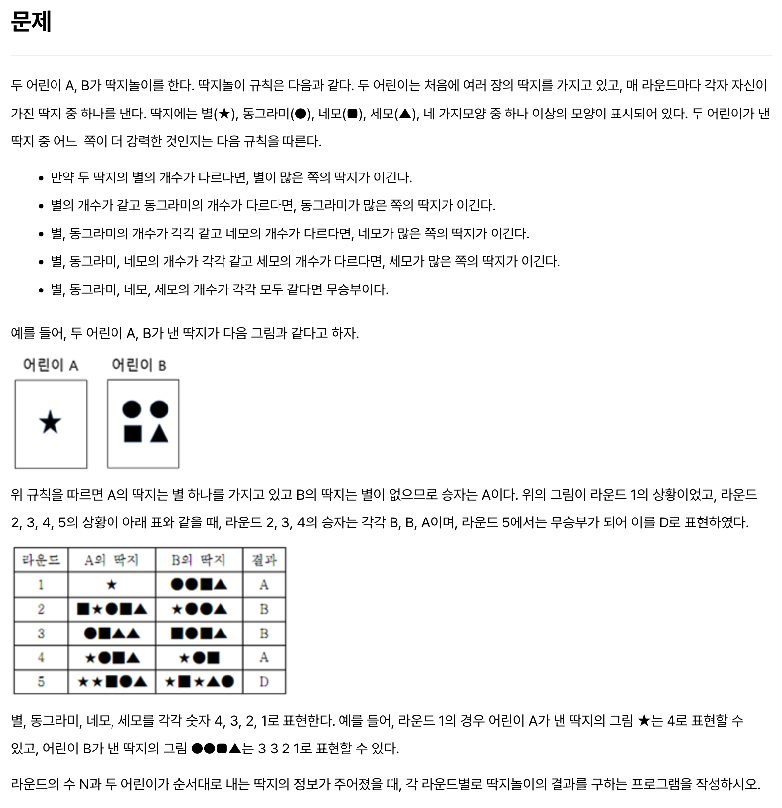
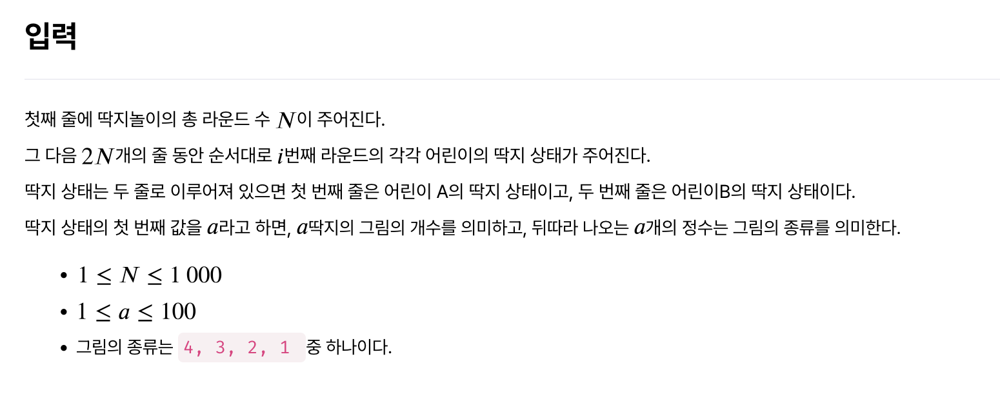
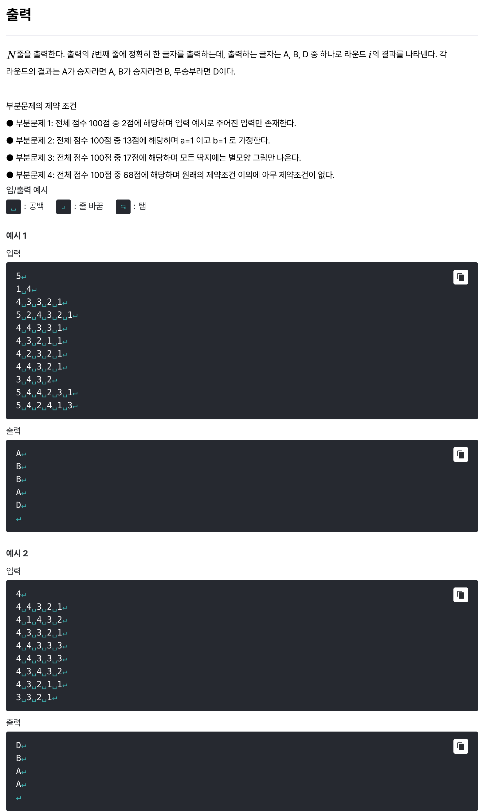

# [딱지놀이](https://level.goorm.io/exam/48130/%EB%94%B1%EC%A7%80%EB%86%80%EC%9D%B4/quiz/1)

> 쉬움







---

## Solution

### v1

```java
import java.io.*;
import java.util.*;

class Main {
	
	public static void main(String[] args) throws Exception {

		BufferedReader br = new BufferedReader(new InputStreamReader(System.in));
		int rounds = Integer.parseInt(br.readLine());

		StringBuilder sb = new StringBuilder();
		StringTokenizer st;
		for (int i = 0; i < rounds; i++) {

			// player A
			st = new StringTokenizer(br.readLine()); 
			st.nextToken(); // 버림 : 개수 불필요
			Map<Integer, Integer> playerAMap = getPlayerMap(st);
			
			// player B
			st = new StringTokenizer(br.readLine()); 
			st.nextToken(); // 버림 : 개수 불필요
			Map<Integer, Integer> playerBMap = getPlayerMap(st);

			// 대결
			int pointA = 0, pointB = 0;
			for (int j = 4; j > 0; j--) { // 4, 3, 2, 1 (별 ~ 세모)
				pointA = playerAMap.getOrDefault(j, 0);
				pointB = playerBMap.getOrDefault(j, 0);
				if (pointA == pointB) {
					continue;
				} else {
					sb.append(pointA > pointB ? "A" : "B").append("\n");
					break;
				}
			}

			if (pointA == pointB) sb.append("D").append("\n");
		}
		
		System.out.println(sb);
	}

	private static Map<Integer, Integer> getPlayerMap(StringTokenizer st) {
		Map<Integer, Integer> playerMap = new HashMap<>();
		while (st.hasMoreTokens()) {
			int shape = Integer.parseInt(st.nextToken());
			playerMap.put(shape, playerMap.getOrDefault(shape, 0) + 1); // 도형 숫자(키)에 따른 개수 카운팅
		}
		return playerMap;
	}
}

// 개선 여지 1 : 메서드 추출을 통해 main 메서드 프로세스 가독성 향샹
// 개선 여지 2 : Player 등의 클래스 생성으로 객체지향 설계
```

