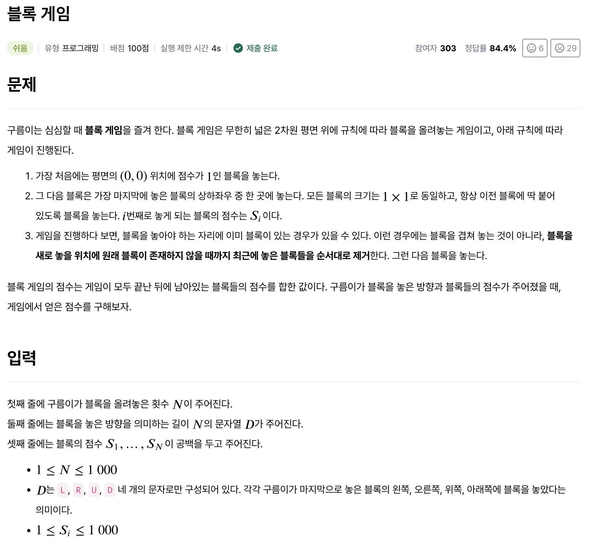
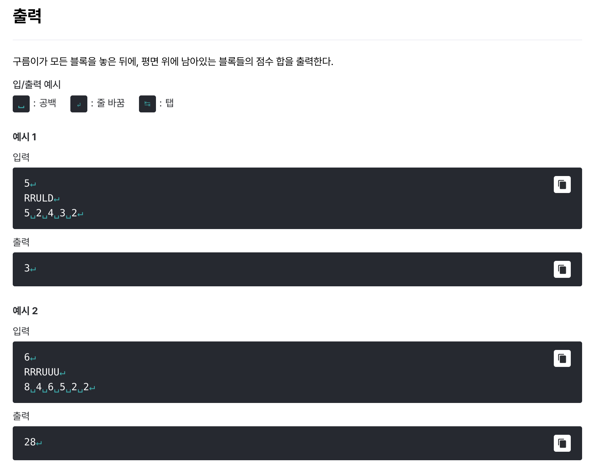

# [블록 게임](https://level.goorm.io/exam/191052/%EB%B8%94%EB%A1%9D-%EA%B2%8C%EC%9E%84/quiz/1)

> 쉬움





---

## Solution

### v1

```java
import java.io.*;
import java.util.*;

class Main {
	public static void main(String[] args) throws Exception {

		BufferedReader br = new BufferedReader(new InputStreamReader(System.in));
		int blocks = Integer.parseInt(br.readLine());

		// 입력값 처리 : 놓을 방향
		char[] directions = br.readLine().toCharArray();

		// 입력값 처리 : 블록 점수
		StringTokenizer st = new StringTokenizer(br.readLine());
		int[] scores = new int[blocks];
		for (int i = 0; i < blocks; i++) {
				scores[i] = Integer.parseInt(st.nextToken());
		}

		// 블록 쌓기
		int x = 0, y = 0;
		ArrayDeque<ScoreInfo> games = new ArrayDeque<>();
		games.push(new ScoreInfo(x, y, 1));

		for (int i = 0; i < blocks; i++) {
			int score = scores[i];
			char move = directions[i];

			switch (move) {
				case 'R':
					x++;
					break;
				case 'L':
					x--;
					break;
				case 'U':
					y++;
					break;
				case 'D':
					y--;
					break;
				default:
					break;
			}

			clensingDuplicatedBlock(games, x, y);
			games.push(new ScoreInfo(x, y, score));
		}

		int resultScore = 0;
		while (games.isEmpty() == false) {
			resultScore += games.pop().score;
		}

		System.out.println(resultScore);
	}

	private static void clensingDuplicatedBlock(ArrayDeque<ScoreInfo> games, int x, int y) {
		ArrayDeque<ScoreInfo> tempDeque = new ArrayDeque<>();
		
		while (games.isEmpty() == false) {
			ScoreInfo game = games.pop();
			tempDeque.push(game);
			
			if (game.x == x && game.y == y) {
				return; // 중복을 만날 때까지 pop -> 블록 걷어내기 완료
			}
		}

		// 중복이 없었다면 다시 원복
		while (tempDeque.isEmpty() == false) {
			games.push(tempDeque.pop());
		}
	}

	public static class ScoreInfo {
		int x;
		int y;
		int score;

		public ScoreInfo(int x, int y, int score) {
			this.x = x;
			this.y = y;
			this.score = score;
		}
	}
}
```

처음에 어떤 자료구조를 쓸지 한참 고민했다가, 결국엔 별도의 `class`를 만드는 게 훨씬 편리하단 것을 알았다. (다른 사람의 풀이를 검색) 왜 코테에서는 클래스를 선언할 생각을 안 했을까...? 아무튼 `ScoreInfo`를 만들어 활용했다.

그 다음 포인트는 `stack`을 이용해 중복 블록을 만날 때까지 모두 제거하는 방식을 구현했다는 점이다. 근데 문제 팁을 보면 `queue`를 이용하라고 되어있다. 이 부분에 대해서 `claude.ai`에게 물어봤는데 `queue`는 비효율적이라는 답변을 받았다. 흠... 문제가 잘못된 걸까?

