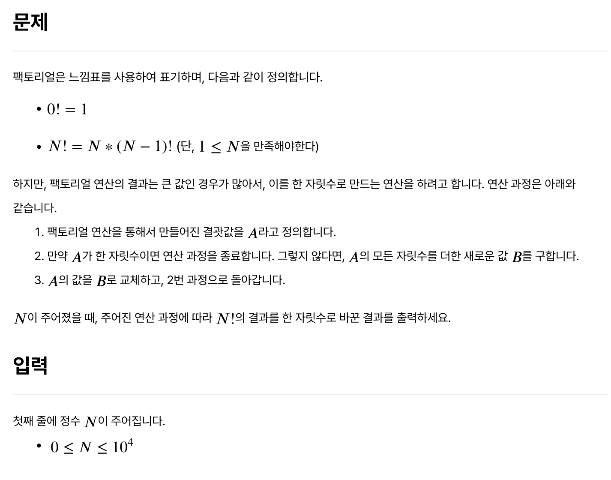
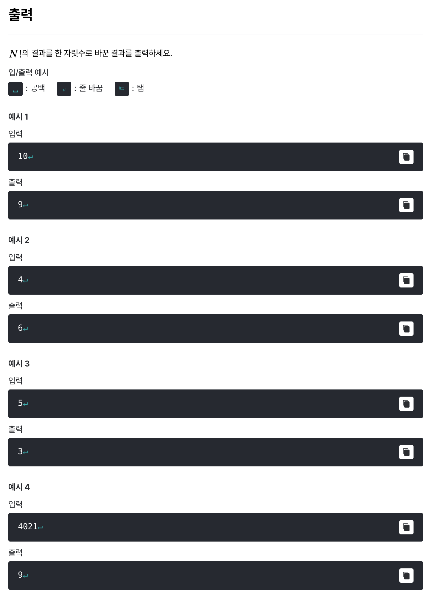

# [어려운 문제](https://level.goorm.io/exam/49054/%EC%96%B4%EB%A0%A4%EC%9A%B4-%EB%AC%B8%EC%A0%9C/quiz/1)

> 쉬움





---

## Solution

### v1 (digital root)

```java
import java.io.*;

class Main {
	public static void main(String[] args) throws Exception {
		BufferedReader br = new BufferedReader(new InputStreamReader(System.in));
		int num = Integer.parseInt(br.readLine());

		if (num == 0) {
			System.out.print(1);
			return;
		}

		if (num >= 6) {
			System.out.print(9);
			return;
		}

		int sum = 1;
		for (int i = 2; i <= num; i++) {
			sum = sum * i;
		}
		// System.out.print("sum: " + sum);

		int result = 0;
		while (sum > 0) {
			result += sum % 10;
			sum /= 10;
		}

		System.out.println(result);
	}
}

// 2 1
// 2 -> 2

// 3 2 1
// 6 -> 6

// 4 3 2 1 
// 24 -> 6

// 5 
// 120 -> 3

// 6
// 720 -> 9

// 7
// 5040 -> 9

// 8
// 40320 -> 9

// 9 
// 362880 -> 27 -> 9

// 계속 9?
```

결론부터 이야기하면 `'디지털 루트'`라는 개념으로 푸는 문제다. 애초에 이 개념을 몰랐기 때문에 입력값의 범위를 보고 분명 계산하다가 오버플로우가 발생할 것을 우려해 어떻게 풀지 한참 고민했으나, 결국 검색으로 솔루션을 알아냈다. 6 이상부터 디지털 루트는 무조건 9가 되는 성질이 있다고 하여, 실제로 수기로 확인해봤는데 계속 9가 나오는 게 사실이었다.(!!!) 

덕분에 약간 이상하게(?) 풀었는데 `디지털 루트`를 몰랐다면 이를 해결하기 위해 너무 길거나, 가독성이 떨어지는 로직이 필요했을 것 같다.

### v2 (진짜 digital root)

```java
import java.io.*;
import java.util.*;

public class Main {
    public static void main(String[] args) throws Exception {
        BufferedReader br = new BufferedReader(new InputStreamReader(System.in));
        long N = Long.parseLong(br.readLine().trim());

        if (N == 0) { // 0! = 1 => 디지털 루트 1
            System.out.println(1);
            return;
        }

        // N >= 6이면 항상 9
        if (N >= 6) {
            System.out.println(9);
            return;
        }

        // N <= 5: N! % 9 계산 후 디지털 루트로 변환
        int mod = 1;
        for (int i = 2; i <= N; i++) mod = (mod * (i % 9)) % 9;
        System.out.println(mod == 0 ? 9 : mod);
    }
}
```

다음은 `chatGPT`가 알려준 **진짜** 로직이다. 