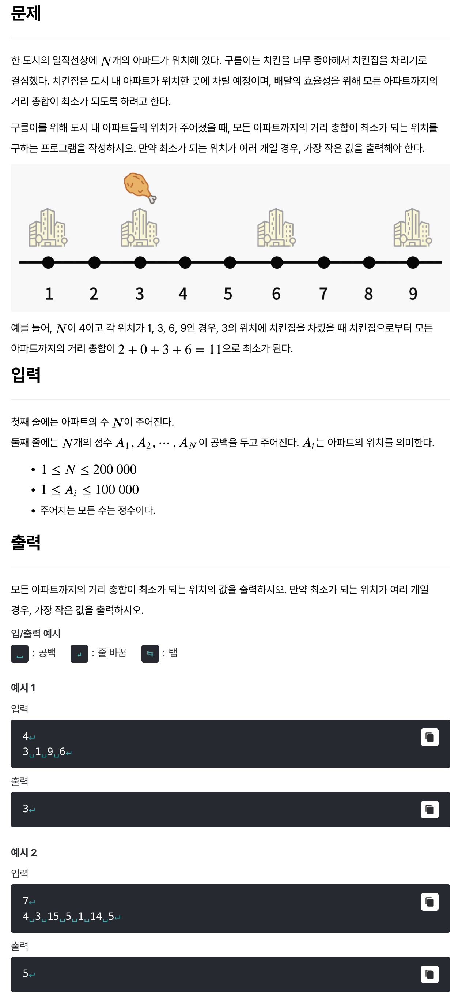

# [최적의 치킨집 위치 찾기](https://level.goorm.io/exam/352812/%EC%B5%9C%EC%A0%81%EC%9D%98-%EC%B9%98%ED%82%A8%EC%A7%91-%EC%9C%84%EC%B9%98-%EC%B0%BE%EA%B8%B0/quiz/1)

> 쉬움



---

## Solution

### v1

```java
import java.io.*;
import java.util.*;

class Main {
    public static void main(String[] args) throws Exception {

				// 입력값 처리
        BufferedReader br = new BufferedReader(new InputStreamReader(System.in));
        int n = Integer.parseInt(br.readLine());
        int[] apartments = new int[n];
        
        StringTokenizer st = new StringTokenizer(br.readLine());
        for (int i = 0; i < n; i++) {
            apartments[i] = Integer.parseInt(st.nextToken());
        }
        
        // 아파트 위치 정렬
        Arrays.sort(apartments);
        
        // 중앙값
        int central;
        if (n % 2 == 1) {
            // 홀수 개: 정확한 중앙값
            central = apartments[n / 2];
        } else {
            // 짝수 개: 두 중앙값 중 작은 것
            central = apartments[n / 2 - 1]; // apartments[n / 2]
        }
        
        // 최적 치킨집 위치 출력
        System.out.println(central);
    }
}
```

처음에는 정렬을 효과적으로 하려고 계수 정렬을 시도하고, 거리를 측정하려고 애를 썼는데, 결국은 그냥 중앙에 가까운 위치만 출력하면 정답이 되었다. 근본적으로 중앙에 가까울수록 유리하다는 점이 기본 해결책이었다. (허탈...)

20만개까지 입력될 수 있길래 Arrays.sort()를 지양하려고 했는데 충분히 통과한다. (...)