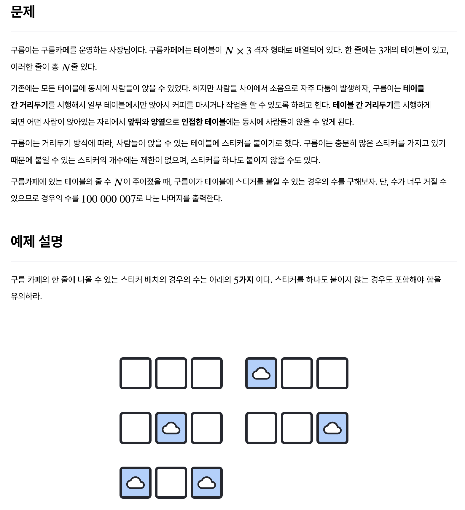
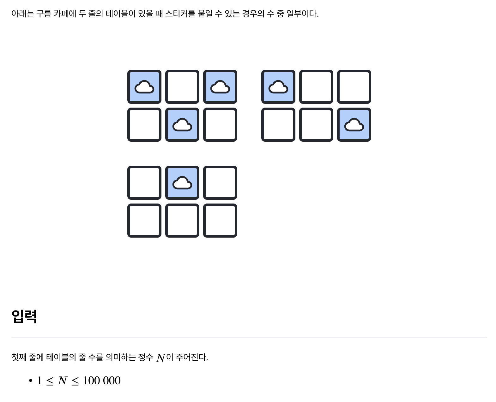

# 거리두기

> 보통






---

## Solution

### v1

```java
import java.io.*;
class Main {
	public static void main(String[] args) throws Exception {
		BufferedReader br = new BufferedReader(new InputStreamReader(System.in));
		int count = Integer.parseInt(br.readLine());

		// 각 상태 정의
		long caseA = 1; // x x x
		long caseB = 1; // o x x
		long caseC = 1; // x o x
		long caseD = 1; // x x o
		long caseE = 1; // o x o

		// 모듈러
		long mod = 100000007L;

		for (int i = 2; i <= count; i++) {
			long nextA = (caseA + caseB + caseC + caseD + caseE) % mod; // caseA 다음에 올 수 있는 경우의 수 : 전부
			long nextB = (caseA + caseC + caseD) % mod; // caseB 다음에 올 수 있는 경우의 수 : A, C, D (이하 반복)
			long nextC = (caseA + caseB + caseD + caseE) % mod;
			long nextD = (caseA + caseB + caseC) % mod;
			long nextE = (caseA + caseC) % mod;

			caseA = nextA;
			caseB = nextB;
			caseC = nextC;
			caseD = nextD;
			caseE = nextE;
		}

		long result = (caseA + caseB + caseC + caseD + caseE) % mod;
		System.out.println(result);
	}
}
```

처음에는 아예 감이 안 왔다. 무식하게 `dp` 점화식을 예상하자니 테이블이 단 2줄만 되어도 경우의 수가 많이 늘어나, 일부 케이스를 놓치기 쉬워보였다. (3, 4까지 손으로 계산하기 무리) 역시 이럴 때는 AI의 도움을 받아야 하는데, 이럴 수가 AI의 풀이는 굉장히 복잡했다. 굳이 이렇게 풀어야 하나 싶을 정도로 코드가 길게 나왔다. `chatGPT`, `claude.ai` 모두 유료 버전임에도 실망스러운 답변이었다.

이번에는 사람이 더 낫다. 이를 어떻게 푸는지 블로그를 찾아보니 적합한 풀이는 `상태 전이`를 활용하는 방법이었다. 어떤 블로그에서 상태 전이를 `dp`로 풀이하셨는데, 가독성이 떨어져서 한눈에 이해되지 않았다. 이를 가지고 `chatGPT`에게 다시 물어보니 보다 가독성이 좋은 상태 전이 풀이를 알려주었다.

#### v1 설명

`case A`는 테이블에 아무런 스티커를 붙이지 않은 경우이고, `case B`는 첫 번째 테이블에만 스티커를, `case C`는 두 번째 테이블에만 스티커를, ... 이런 식으로 반복해서 `N`줄에 상관없이 첫번째 줄에 대한 모든 케이스 **5개**를 정의한다. 이 5개는 문제에서 이미 제시하고 있다.

자 그럼, 첫 번째 줄이 case A에 해당한다면, 그 다음 줄에는 어떤 경우(case)가 가능할까? 당연하게도 모든 경우가 가능하다. 첫 번째 줄에 스티커를 붙이지 않은 경우이므로, 어떤 케이스가 와도 문제가 되지 않는다.

첫 번째 줄이 case B에 해당한다면 어떨까? b의 경우는 좌측 첫 번째 테이블에만 스티커가 붙은 것이므로, 그 다음에 올 수 있는 테이블은 첫 번째 테이블에 스티커가 없는 다른 경우들에 해당한다. 즉, `case A`, `C`, `D`가 가능하다. 이들은 첫 번째 테이블에 스티커를 붙이지 않은 경우니까.

이런 식으로 `C`, `D`, `E`까지 반복해서 경우의 수를 합산한다. 이 과정에서 숫자가 커질 수 있으므로 문제에서 제시한 `100000007L` 값으로 모듈러 연산을 수행한다. 그렇게 마지막에는 모든 경우의 수를 다시 합산하고, 마찬가지로 모듈러 연산을 수행해 출력하면 된다.


### v2 (참고)

```java
import java.io.*;

class Main {
	static final int MOD = 100000007;
	
	public static void main(String[] args) throws Exception {
		BufferedReader br = new BufferedReader(new InputStreamReader(System.in));
		int n = Integer.parseInt(br.readLine());
		
		long[][] dp = new long[n + 1][5];
		
		dp[1][0] = 1;		//빈거
		dp[1][1] = 1;		//#00
		dp[1][2] = 1;		//0#0
		dp[1][3] = 1;		//00#
		dp[1][4] = 1;		//#0#
		
		for (int i = 2; i <= n; i++){
			dp[i][0] = (dp[i-1][0] + dp[i-1][1] + dp[i-1][2] + dp[i-1][3] + dp[i-1][4]) % MOD;
			dp[i][1] = (dp[i-1][0] + dp[i-1][2] + dp[i-1][3]) % MOD;
			dp[i][2] = (dp[i-1][0] + dp[i-1][1] + dp[i-1][3] + dp[i-1][4]) % MOD;
			dp[i][3] = (dp[i-1][0] + dp[i-1][2] + dp[i-1][3]) % MOD;
			dp[i][4] = (dp[i-1][0] + dp[i-1][2]) % MOD;
		}
		
		long ans = (dp[n][0] + dp[n][1] + dp[n][2] + dp[n][3] + dp[n][4]) % MOD;
		
		System.out.println(ans);
	}
}
출처: https://kwang2134.tistory.com/1 [kwang2134 님의 블로그:티스토리]
```

이는 내가 참고했던 dp 풀이이다.