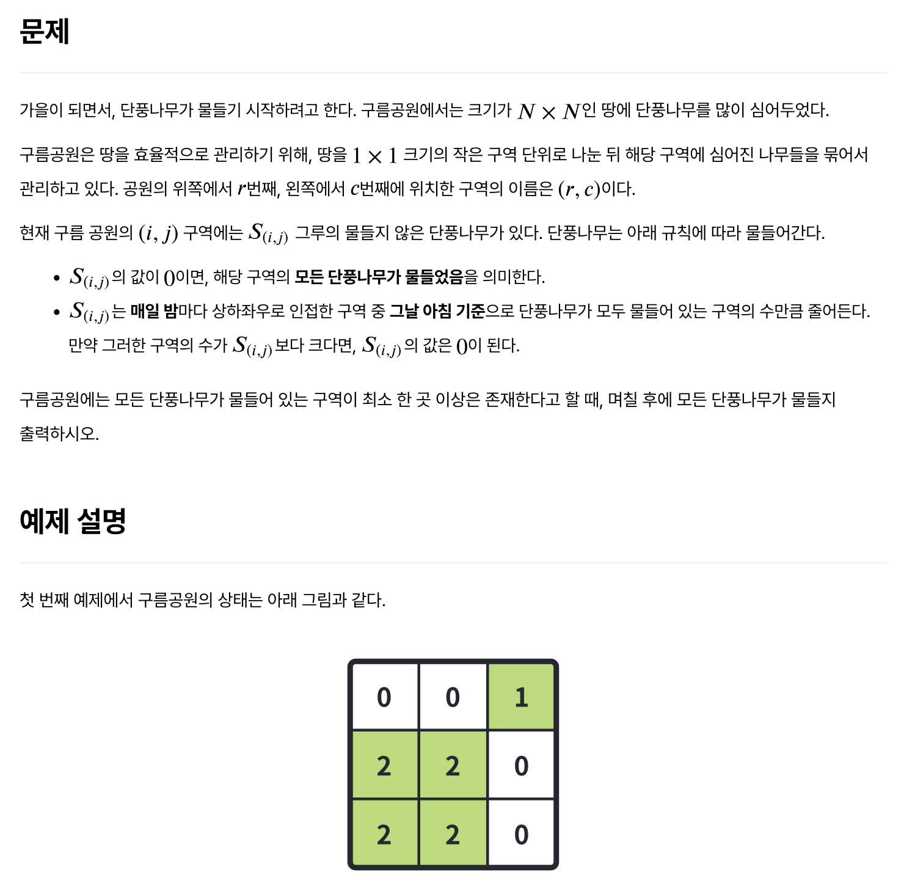
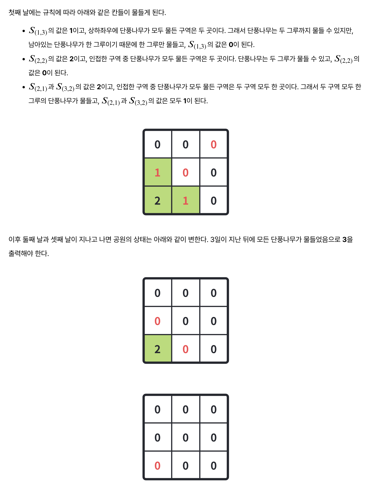
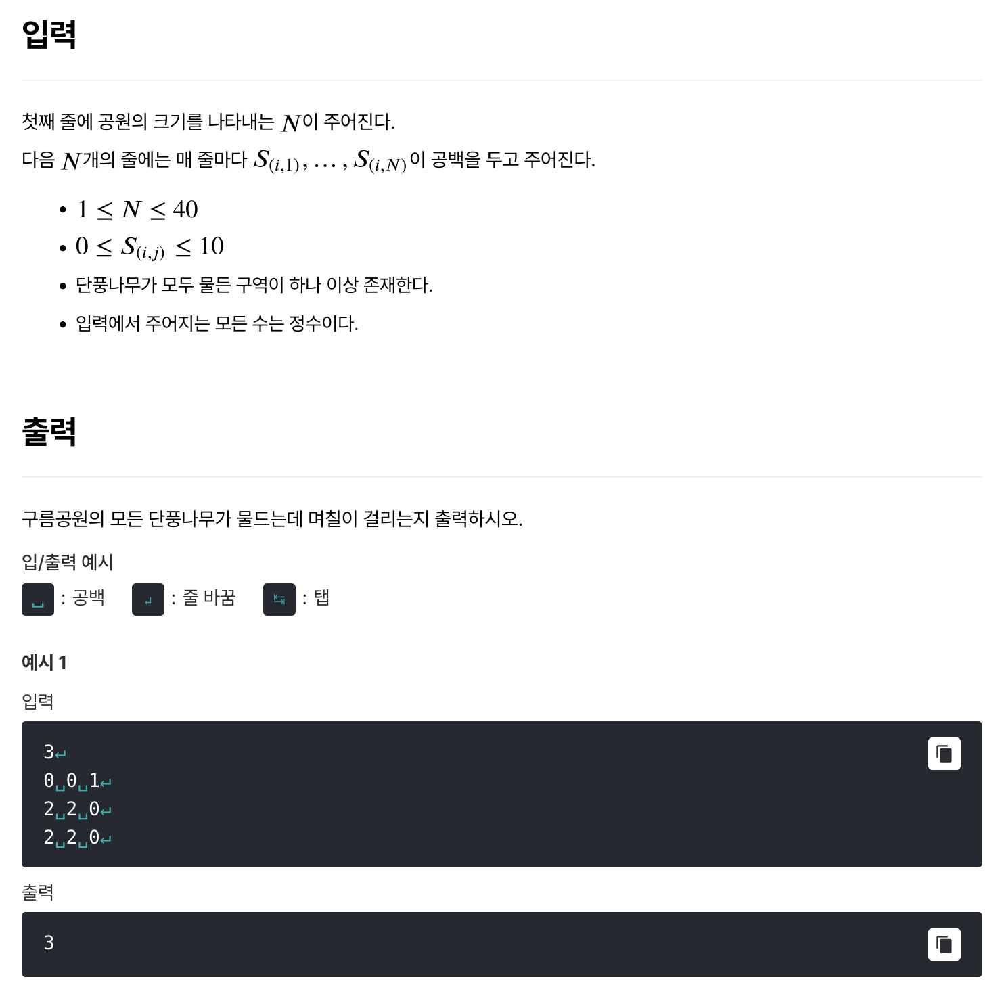

# [단풍나무](https://level.goorm.io/exam/167345/%EB%8B%A8%ED%92%8D%EB%82%98%EB%AC%B4/quiz/1)

> 보통







---

## Solution

### v1 (오답)

```java
import java.io.*;
import java.util.*;

class Main {
	public static void main(String[] args) throws Exception {

		// 입력값 전처리
		BufferedReader br = new BufferedReader(new InputStreamReader(System.in));
		int size = Integer.parseInt(br.readLine());

		StringTokenizer st;
		int[][] park = new int[size + 1][size + 1];
		for (int i = 1; i < size + 1; i++) {
			st = new StringTokenizer(br.readLine());
			for (int j = 1; j < size + 1; j++) {
				park[i][j] = Integer.parseInt(st.nextToken());
			}
		}

		// System.out.print(park[1][3]);
		// System.out.print(park[3][1]);

		int days = 1;
		while (true) {
			int maples = 0;

			for (int i = 1; i < size + 1; i++) {
				for (int j = 1; j < size + 1; j++) {
					
					int value = park[i][j];
					if (value <= 0) {
						// 단풍: 사방의 칸에 -1
						spreadMaple(park, size, i, j);

						// 단풍: 카운트 (종료)
						maples++;
					}
				}
			}

			if (maples == size * size) {
				break;
			}
			days++;
		}

		System.out.println(days);
	}

	private static void spreadMaple(int[][] park, int size, int x, int y) {
		if (x > 1) {
			park[x - 1][y] -= 1;
		}
		if (x < size) {
			park[x + 1][y] -= 1;
		}
		if (y > 1) {
			park[x][y - 1] -= 1;
		}
		if (y < size) {
			park[x][y + 1] -= 1;
		}
	}
	
}

/*
3
0 0 1
2 2 0
2 2 0
--> (3)
*/
```

일단은 오답이다. 일단 단순하게 0(이하로 계산했다)을 기점으로 주변을 -1씩 차감하는 형태로 진행했다. 문제에 있는 예시는 통과하지만 절반 이상의 테스트 케이스에서 실패했다. 이 정도면 근본적인 문제가 있는 셈이다. 아래, **내가 맘대로 짠 예시**를 대입해봤는데 엉뚱한 결과가 나온다.

```text
4
0 1 1 0
2 0 0 2
2 0 2 0
3 4 5 6
```

분명 수기로 계산하면 6일이 걸려야 맞는데, 5일이라는 답이 출력되었다. 공원이 위 상태일때 **4일차**에 이렇게 물이 드는데, 

```text
// (4)
0 0 0 0
0 0 0 0
0 0 0 0
0 0 2 2
```

여기서가 문제다. (4, 3)의 값이 좌,우의 단풍(0)에 의해 0이 되고, 그 다음 (4, 4) 칸을 처리하는데, 앞서 좌측(4, 3)이 0이 되었기 때문에 여기서 모두 단풍이 되어버리는 것이다. 문제의 설명 대로 **5일차**가 되면, 마지막 줄은  `0 0 0 1`이 되어야 하고, 최종적으로는 하루가 더 필요한 것이다.

### v2 (개선)

```java
import java.io.*;
import java.util.*;

class Main {
	public static void main(String[] args) throws Exception {

		// 입력값 전처리
		BufferedReader br = new BufferedReader(new InputStreamReader(System.in));
		int size = Integer.parseInt(br.readLine());

		StringTokenizer st;
		int[][] park = new int[size][size];
		for (int i = 0; i < size; i++) {
			st = new StringTokenizer(br.readLine());
			for (int j = 0; j < size; j++) {
				park[i][j] = Integer.parseInt(st.nextToken());
			}
		}

		// 물듬 처리
		int days = 0;
		while (true) {

			if (allMaples(park)) {
				break;
			}

			int[][] parkNextDay = new int[size][size];  // 작업용 배열 : 기존 배열을 수정하여 자동으로 전이되는 것을 방지
			for (int i = 0; i < size; i++) {
				for (int j = 0; j < size; j++) {
					parkNextDay[i][j] = park[i][j];
				}
			}
			
			for (int i = 0; i < size; i++) {
				for (int j = 0; j < size; j++) {
					
					int value = park[i][j];
					if (value <= 0) {
						// 단풍 처리
						spreadMaple(parkNextDay, size, i, j);
					}
				}
			}

			park = parkNextDay.clone();
			days++;
		}

		System.out.println(days);
	}

	private static void spreadMaple(int[][] park, int size, int x, int y) {
		if (x > 0) {
			park[x - 1][y] -= 1;
		}
		if (x < size - 1) {
			park[x + 1][y] -= 1;
		}
		if (y > 0) {
			park[x][y - 1] -= 1;
		}
		if (y < size - 1) {
			park[x][y + 1] -= 1;
		}
	}

	private static boolean allMaples(int[][] park) {

		for (int[] row : park) {
			for (int col : row) {
				if (col > 0 ) return false;
			}
		}
		
		return true;
	}
	
}

/*
3
0 0 1
2 2 0
2 2 0
--> (3)
*/

/*
4
0 1 1 0
2 0 0 2
2 0 2 0
3 4 5 6
--> (6)
*/

```

별도의 작업용 배열(`parkNextDay`)을 선언해 사용했다. 얕은 복사가 되지 않게 주의해야 했으며, 단풍 카운트가 부정확할 것 같아서 전체 단풍나무 확인용 메서드를 별도로 만들었다.