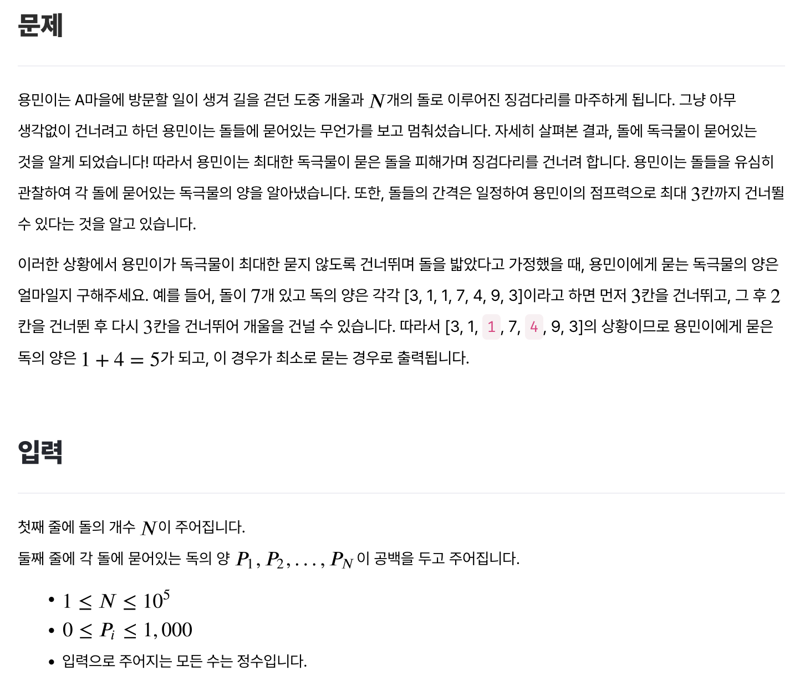
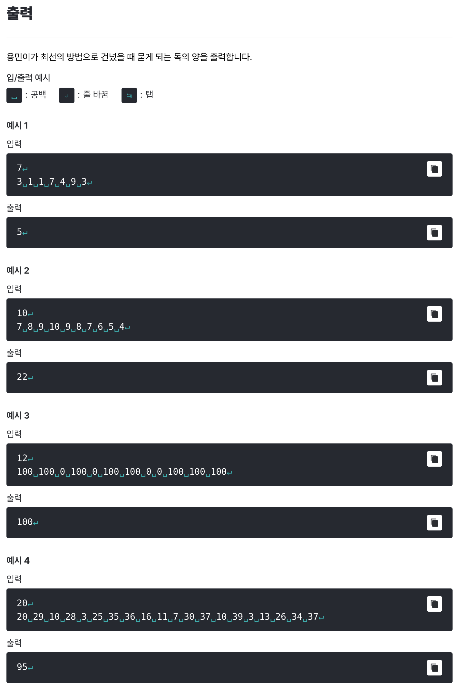

# [징검다리 건너기](https://level.goorm.io/exam/49112/%EC%A7%95%EA%B2%80%EB%8B%A4%EB%A6%AC-%EA%B1%B4%EB%84%88%EA%B8%B0/quiz/1)

> 보통





---

## Solution

### v1 (dp)

```java
import java.io.*;
import java.util.*;

class Main {
	public static void main(String[] args) throws Exception {

		// 입력값 전처리
		BufferedReader br = new BufferedReader(new InputStreamReader(System.in));
		int count = Integer.parseInt(br.readLine());

		if (count < 3) {
			// 조기 종료
			System.out.println(0);
			return;
		}

		StringTokenizer st = new StringTokenizer(br.readLine());
		int[] stones = new int[count + 1];
		for (int i = 1; i < count + 1; i++) {
			stones[i] = Integer.parseInt(st.nextToken());
		}

		// dp
		int[] dp = new int[count + 1];
		dp[0] = stones[0];
		dp[1] = stones[1];
		dp[2] = stones[2];

		for (int i = 3; i < count + 1; i++) {
			dp[i] = stones[i] + Math.min(Math.min(dp[i-1], dp[i-2]), dp[i-3]);
			// System.out.println("dp[" + i + "]: " + dp[i]);
		}

		int result = Math.min(Math.min(dp[count], dp[count-1]), dp[count-2]);
		System.out.println(result);
	}
}

// stones)
// 3 1 1 7 4 9  3
// dp)
// 3 1 1 8 5 10 8 -> (5)

// stones)
// 100 100   0 100   0 100 100   0   0 100 100 100
// dp)
// 100 100   0 100   0 100 100   0   0 100 100 100 -> (100)
```

처음에는 `dp`를 정의하는 과정에서 **"해당 위치에 도착할 때 드는 최소 비용"**을 기준으로 하려했더니 점화식을 세우는 게 잘 되지 않았다. 결국은 **"해당 돌을 밟았을 때의 최소 비용(독극물)"**을 기준으로 `dp`를 정의하고, 최종 출력에서 **마지막 3개 중, 가장 작은 것**을 출력하는 것으로 수정 하니 통과했다. 